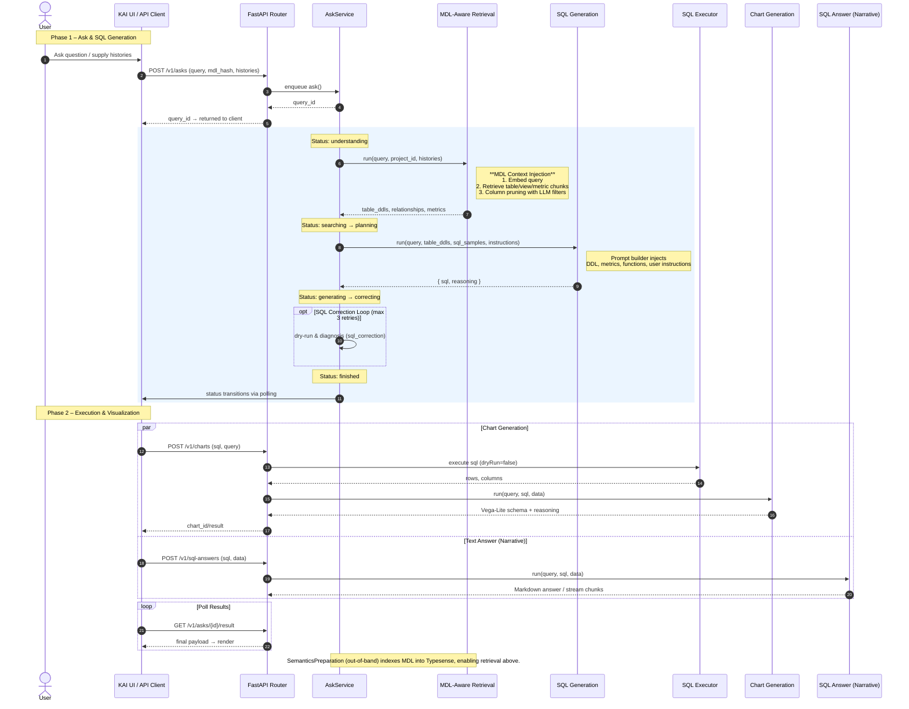

# Implementation Plan: MDL & GENBI for KAI

## Executive Summary

This document outlines a comprehensive plan to implement **MDL (Model Definition Language)** and **GENBI (Generative Business Intelligence)** capabilities in KAI, drawing inspiration from WrenAI's architecture while leveraging KAI's existing strengths.

---

## Part 0: GenBI Flow Overview

### Complete GenBI Pipeline (WrenAI Reference)



### Key Flow Differences: WrenAI vs KAI (Current)

| Aspect | WrenAI | KAI (Current) | KAI (Target) |
|--------|--------|---------------|--------------|
| **Entry Point** | AskingService → WrenAIAdaptor | Direct SQL Generation API | AskService with status tracking |
| **Status Tracking** | understanding→searching→planning→generating→correcting→finished | Single status (VALID/INVALID) | Full status pipeline |
| **Context Source** | MDL Manifest (indexed) | TableDescription + BusinessGlossary | Unified MDL Manifest |
| **Chart Output** | Vega-Lite via dedicated pipeline | ChartRecommendation (basic) | Vega-Lite pipeline |
| **Text Answer** | sql_answer pipeline (narrative) | Not supported | SQL Answer pipeline |

---

## Part 1: Architecture Comparison

### WrenAI Architecture Overview

```
┌─────────────────────────────────────────────────────────────┐
│                    WREN AI ARCHITECTURE                     │
├─────────────────────────────────────────────────────────────┤
│  Frontend (wren-ui)          Next.js + Apollo GraphQL       │
│  Backend (wren-ai-service)   FastAPI + Haystack + Hamilton  │
│  Vector DB                   Qdrant                         │
│  LLM Provider                LiteLLM (multi-provider)       │
│  Semantic Layer              MDL (JSON Schema)              │
└─────────────────────────────────────────────────────────────┘
```

### KAI Architecture Overview

```
┌─────────────────────────────────────────────────────────────┐
│                     KAI ARCHITECTURE                        │
├─────────────────────────────────────────────────────────────┤
│  Backend                     FastAPI + LangGraph            │
│  Vector DB                   Typesense                      │
│  LLM Provider                Multi-provider (OpenAI/Gemini) │
│  Agent Framework             DeepAgents + LangChain         │
│  Semantic Layer              TableDescription + Glossary    │
└─────────────────────────────────────────────────────────────┘
```

### Key Differences

| Aspect | WrenAI | KAI |
|--------|--------|-----|
| **Semantic Layer** | MDL (comprehensive JSON schema) | Fragmented (TableDescription, BusinessGlossary, Instructions) |
| **Relationships** | Explicit in MDL with join types | Implicit via FK in ColumnDescription |
| **Metrics** | First-class MDL entity with dimensions/measures | BusinessGlossary (SQL templates only) |
| **Calculated Fields** | Expression-based in MDL columns | Not supported |
| **Views** | MDL views with SQL statements | Not supported |
| **Caching** | MDL-level cache configuration | Not supported |
| **Access Control** | Row/Column level in MDL | Not supported |
| **Chart Generation** | Dedicated pipeline with Vega-Lite | ChartRecommendation (basic) |
| **Pipeline Framework** | Haystack + Hamilton (async DAG) | LangGraph + DeepAgents |

---

## Part 2: Gap Analysis

### MDL → KAI Migration Matrix

| MDL Entity | Required Semantics | Current KAI Handling | Gaps & Needed Modules |
|------------|-------------------|---------------------|----------------------|
| **Models** (`models[]`) | Physical tables or `refSql` views, caching hints, display names, nested columns | Stored as flat `table_descriptions` in Typesense with minimal metadata | Add structured model registry to persist refSql, caching, catalog/schema, complex column shapes; expose ingestion API for MDL payloads |
| **Views** (`views[]`) | Named SQL statements with properties (description, question, summary) | No explicit support; treated as plain tables | Introduce View module with MDL view statements, viewId references; integrate with LangGraph preview/validation tools |
| **Columns** (`columns[]`) | Data types, calc expressions, ACL, hidden flags, display names | Column metadata flattened into comma-separated strings | Normalize into column tables (with `is_calculated`, expressions, data types); surface to retrieval tools |
| **Relationships** (`relationships[]`) | Join type, condition, participating models for semantic joins | Only basic FK inference in schema discovery | Build relationship graph module; store join metadata; expose to LangGraph planners for enforced joins + recommendations |
| **Metrics** (`metrics[]`) | Dimensions, aggregation, filters, time grains, display metadata | Business glossary stores free-form SQL answers | Extend Business Glossary with MDL metric fields (dimensions, measures, grain); provide metric-aware prompts |
| **Deployments** | MDL packaged, hashed, deployed via `/v1/semantics` with validation/indexing lifecycle | No manifest ingestion; schema read ad-hoc | Implement MDL deploy endpoints (store manifest, compute hashes, trigger Typesense indexing jobs) |
| **ACLs** (`rowLevelAccessControls`, `columnLevelAccessControl`) | Row/column access filters referencing session props | Not represented in KAI security layers | Create ACL module; apply filters during retrieval + SQL generation; enforce at execution |
| **Enum definitions** / session props | Controlled vocabularies & runtime session bindings | No equivalents | Add dictionary tables; propagate to prompt builders and UI for filtering/parameterization |

### What KAI Has That Maps to MDL

| KAI Component | MDL Equivalent | Gap |
|---------------|----------------|-----|
| `TableDescription` | `models` | Missing: refSql, calculated fields, caching |
| `ColumnDescription` | `columns` | Missing: expressions, relationship refs, access control |
| `BusinessGlossary` | `metrics` (partial) | Missing: dimensions, measures, timeGrain |
| `ForeignKeyDetail` | `relationships` | Missing: join types, explicit conditions |
| N/A | `views` | **Complete gap** |
| N/A | `enumDefinitions` | **Complete gap** |
| N/A | `accessControls` | **Complete gap** |

### What KAI Has That WrenAI Doesn't (Advantages to Preserve)

| KAI Feature | Notes | Integration Strategy |
|-------------|-------|---------------------|
| **Long-term Memory** | Session-scoped + shared memory system | Enhance MDL context with memory-based user preferences |
| **Skills System** | Reusable analysis patterns | Skills can reference MDL metrics/views |
| **Autonomous Agents** | Multi-step task execution with subagents | Agents use MDL for context-aware analysis |
| **Interactive Sessions** | LangGraph-based multi-turn conversations | Sessions maintain MDL hash for consistency |
| **RAG Documents** | Document search integration | Documents augment MDL semantics |
| **MCP Integration** | External tool connectivity | MCP tools can query MDL-defined views |

---

## Part 3: Implementation Strategy

### Phase 0: Alignment & Tooling (1 sprint / 2 weeks)

**Objective**: Establish foundation for MDL integration with validation and infrastructure.

#### 0.1 Tasks

1. **Import MDL Schema**: Copy `mdl.schema.json` into KAI repo at `app/modules/mdl/schema/`
2. **JSON Schema Validation Service**: Create validation utility using `jsonschema` library
3. **Document MDL Ingestion Contract**: API spec for MDL manifest upload
4. **Typesense Index Setup**: Create collections for MDL objects (models, columns, relationships, metrics, views)
5. **CI Schema Tests**: Add tests to validate MDL manifests against schema

#### 0.2 Deliverables

**File**: `app/modules/mdl/validators/__init__.py`

```python
import json
from jsonschema import validate, ValidationError, Draft202012Validator
from pathlib import Path

class MDLValidator:
    """Validate MDL manifests against JSON Schema."""

    _schema = None
    _schema_path = Path(__file__).parent.parent / "schema" / "mdl.schema.json"

    @classmethod
    def get_schema(cls) -> dict:
        if cls._schema is None:
            with open(cls._schema_path) as f:
                cls._schema = json.load(f)
        return cls._schema

    @classmethod
    def validate(cls, manifest: dict) -> tuple[bool, list[str]]:
        """
        Validate MDL manifest.
        Returns (is_valid, list_of_errors).
        """
        schema = cls.get_schema()
        validator = Draft202012Validator(schema)
        errors = list(validator.iter_errors(manifest))

        if errors:
            error_messages = [
                f"{'.'.join(str(p) for p in e.path)}: {e.message}"
                for e in errors
            ]
            return False, error_messages

        return True, []

    @classmethod
    def validate_or_raise(cls, manifest: dict) -> None:
        """Validate and raise ValidationError if invalid."""
        is_valid, errors = cls.validate(manifest)
        if not is_valid:
            raise ValidationError(f"MDL validation failed: {errors}")
```

#### 0.3 Prerequisites

- Agreement on canonical storage (Typesense vs Postgres)
- Infrastructure access to shared vector store
- Team alignment on MDL version to adopt

#### 0.4 Success Metrics

- [ ] MDL manifest from WrenAI sample validates end-to-end
- [ ] CI schema tests run on every PR
- [ ] Typesense collections created and accessible

#### 0.5 Risks & Mitigations

| Risk | Impact | Mitigation |
|------|--------|------------|
| Schema drift vs upstream MDL | High | Vendor MDL version pin + contract tests against `wren-mdl/mdl.schema.json` |
| Typesense schema conflicts | Medium | Use prefixed collection names (`mdl_*`) |

---

### Phase 1: MDL Schema & Models (2 sprints / 4 weeks)

#### 1.1 Create MDL Schema Definition

**File**: `app/modules/mdl/schema/mdl.schema.json`

Adapt WrenAI's schema with KAI-specific extensions:

```json
{
  "$schema": "https://json-schema.org/draft/2020-12/schema",
  "$id": "https://kai.dev/mdl.schema.json",
  "title": "KAI MDL Manifest Schema",
  "type": "object",
  "properties": {
    "catalog": { "type": "string" },
    "schema": { "type": "string" },
    "dataSource": { "type": "string", "enum": ["postgresql", "mysql", "bigquery", "duckdb", "sqlite"] },
    "models": { "$ref": "#/$defs/models" },
    "relationships": { "$ref": "#/$defs/relationships" },
    "metrics": { "$ref": "#/$defs/metrics" },
    "views": { "$ref": "#/$defs/views" },
    "enumDefinitions": { "$ref": "#/$defs/enumDefinitions" }
  },
  "$defs": {
    // ... (full schema definitions)
  }
}
```

#### 1.2 Create MDL Models

**File**: `app/modules/mdl/models/__init__.py`

```python
from pydantic import BaseModel, Field
from typing import List, Optional, Dict, Any
from enum import Enum

class JoinType(str, Enum):
    ONE_TO_ONE = "ONE_TO_ONE"
    ONE_TO_MANY = "ONE_TO_MANY"
    MANY_TO_ONE = "MANY_TO_ONE"
    MANY_TO_MANY = "MANY_TO_MANY"

class MDLColumn(BaseModel):
    name: str
    type: str
    relationship: Optional[str] = None
    is_calculated: bool = False
    not_null: bool = False
    expression: Optional[str] = None
    is_hidden: bool = False
    properties: Dict[str, Any] = {}

class TableReference(BaseModel):
    catalog: Optional[str] = None
    schema: Optional[str] = None
    table: str

class MDLModel(BaseModel):
    name: str
    table_reference: Optional[TableReference] = None
    ref_sql: Optional[str] = None
    columns: List[MDLColumn] = []
    primary_key: Optional[str] = None
    cached: bool = False
    refresh_time: Optional[str] = None
    properties: Dict[str, Any] = {}

class MDLRelationship(BaseModel):
    name: str
    models: List[str]  # Exactly 2 models
    join_type: JoinType
    condition: str
    properties: Dict[str, Any] = {}

class TimeGrain(BaseModel):
    name: str
    ref_column: str
    date_parts: List[str]  # YEAR, QUARTER, MONTH, WEEK, DAY, etc.

class MDLMetric(BaseModel):
    name: str
    base_object: str  # Reference to model
    dimension: List[MDLColumn] = []
    measure: List[MDLColumn] = []
    time_grain: List[TimeGrain] = []
    cached: bool = False
    refresh_time: Optional[str] = None
    properties: Dict[str, Any] = {}

class MDLView(BaseModel):
    name: str
    statement: str  # SQL statement
    properties: Dict[str, Any] = {}

class EnumValue(BaseModel):
    name: str
    value: Optional[str] = None
    properties: Dict[str, Any] = {}

class MDLEnumDefinition(BaseModel):
    name: str
    values: List[EnumValue]
    properties: Dict[str, Any] = {}

class MDLManifest(BaseModel):
    """Complete MDL Manifest for a database connection."""
    id: Optional[str] = None
    db_connection_id: str
    catalog: str
    schema: str
    data_source: str
    models: List[MDLModel] = []
    relationships: List[MDLRelationship] = []
    metrics: List[MDLMetric] = []
    views: List[MDLView] = []
    enum_definitions: List[MDLEnumDefinition] = []
    mdl_hash: Optional[str] = None  # For caching/versioning
    created_at: str = Field(default_factory=lambda: datetime.now().isoformat())
    updated_at: Optional[str] = None
```

#### 1.3 Create MDL Builder Service

**File**: `app/modules/mdl/services/mdl_builder.py`

```python
class MDLBuilder:
    """Build MDL manifest from KAI's existing data structures."""

    def __init__(
        self,
        table_descriptions: List[TableDescription],
        business_glossaries: List[BusinessGlossary],
        db_connection: DatabaseConnection,
    ):
        self.table_descriptions = table_descriptions
        self.business_glossaries = business_glossaries
        self.db_connection = db_connection
        self.manifest = MDLManifest(
            db_connection_id=db_connection.id,
            catalog=db_connection.alias,
            schema=db_connection.schemas[0] if db_connection.schemas else "public",
            data_source=db_connection.dialect,
        )

    def build(self) -> MDLManifest:
        """Build complete MDL manifest."""
        self._add_models()
        self._add_relationships()
        self._add_metrics()
        self._compute_hash()
        return self.manifest

    def _add_models(self):
        """Convert TableDescriptions to MDL Models."""
        for td in self.table_descriptions:
            model = MDLModel(
                name=td.table_name,
                table_reference=TableReference(
                    schema=td.db_schema,
                    table=td.table_name,
                ),
                columns=[
                    MDLColumn(
                        name=col.name,
                        type=col.data_type,
                        not_null=col.is_primary_key,
                        properties={
                            "description": col.description,
                            "low_cardinality": col.low_cardinality,
                            "categories": col.categories,
                        }
                    )
                    for col in td.columns
                ],
                primary_key=next(
                    (col.name for col in td.columns if col.is_primary_key),
                    None
                ),
                properties={
                    "description": td.table_description,
                    "displayName": td.table_name,
                }
            )
            self.manifest.models.append(model)

    def _add_relationships(self):
        """Extract relationships from foreign keys."""
        for td in self.table_descriptions:
            for col in td.columns:
                if col.foreign_key:
                    rel = MDLRelationship(
                        name=f"{td.table_name}_{col.name}_fk",
                        models=[td.table_name, col.foreign_key.reference_table],
                        join_type=JoinType.MANY_TO_ONE,
                        condition=f'"{td.table_name}".{col.name} = "{col.foreign_key.reference_table}".{col.foreign_key.field_name}'
                    )
                    self.manifest.relationships.append(rel)

    def _add_metrics(self):
        """Convert BusinessGlossary to MDL Metrics."""
        for bg in self.business_glossaries:
            # Parse SQL to extract dimensions/measures (simplified)
            metric = MDLMetric(
                name=bg.metric,
                base_object=self._extract_base_table(bg.sql),
                measure=[
                    MDLColumn(
                        name=bg.metric,
                        type="DECIMAL",
                        is_calculated=True,
                        expression=bg.sql,
                    )
                ],
                properties={
                    "alias": bg.alias,
                    "sql": bg.sql,
                }
            )
            self.manifest.metrics.append(metric)

    def _compute_hash(self):
        """Compute MD5 hash of manifest for caching."""
        import hashlib
        content = self.manifest.model_dump_json()
        self.manifest.mdl_hash = hashlib.md5(content.encode()).hexdigest()
```

#### 1.4 Create MDL Repository & Service

**File**: `app/modules/mdl/repositories/__init__.py`

```python
class MDLManifestRepository:
    def __init__(self, storage: Storage):
        self.storage = storage
        self.collection_name = "mdl_manifests"

    def save(self, manifest: MDLManifest) -> MDLManifest:
        """Save or update MDL manifest."""
        data = manifest.model_dump()
        if manifest.id:
            self.storage.update(self.collection_name, manifest.id, data)
        else:
            manifest.id = self.storage.insert(self.collection_name, data)
        return manifest

    def get_by_connection(self, db_connection_id: str) -> Optional[MDLManifest]:
        """Get MDL manifest for a database connection."""
        results = self.storage.find(
            self.collection_name,
            {"db_connection_id": db_connection_id},
            limit=1
        )
        return MDLManifest(**results[0]) if results else None

    def get_by_hash(self, mdl_hash: str) -> Optional[MDLManifest]:
        """Get MDL manifest by hash (for caching)."""
        results = self.storage.find(
            self.collection_name,
            {"mdl_hash": mdl_hash},
            limit=1
        )
        return MDLManifest(**results[0]) if results else None
```

**File**: `app/modules/mdl/services/__init__.py`

```python
class MDLService:
    def __init__(
        self,
        storage: Storage,
        table_description_repo: TableDescriptionRepository,
        business_glossary_service: BusinessGlossaryService,
        database_connection_repo: DatabaseConnectionRepository,
    ):
        self.storage = storage
        self.table_repo = table_description_repo
        self.glossary_service = business_glossary_service
        self.db_conn_repo = database_connection_repo
        self.mdl_repo = MDLManifestRepository(storage)

    def build_mdl(self, db_connection_id: str) -> MDLManifest:
        """Build MDL manifest from existing KAI data."""
        db_conn = self.db_conn_repo.get_by_id(db_connection_id)
        tables = self.table_repo.get_all_tables_by_db({
            "db_connection_id": db_connection_id,
            "sync_status": TableDescriptionStatus.SCANNED.value,
        })
        glossaries = self.glossary_service.get_all_by_connection(db_connection_id)

        builder = MDLBuilder(
            table_descriptions=tables,
            business_glossaries=glossaries,
            db_connection=db_conn,
        )
        manifest = builder.build()
        return self.mdl_repo.save(manifest)

    def get_mdl(self, db_connection_id: str) -> Optional[MDLManifest]:
        """Get cached MDL or build new one."""
        manifest = self.mdl_repo.get_by_connection(db_connection_id)
        if not manifest:
            manifest = self.build_mdl(db_connection_id)
        return manifest

    def refresh_mdl(self, db_connection_id: str) -> MDLManifest:
        """Force rebuild MDL manifest."""
        return self.build_mdl(db_connection_id)

    def to_ddl(self, manifest: MDLManifest) -> str:
        """Convert MDL to DDL string for LLM context."""
        ddl_parts = []
        for model in manifest.models:
            columns = ", ".join([
                f"{col.name} {col.type}" +
                (" PRIMARY KEY" if model.primary_key == col.name else "") +
                (" NOT NULL" if col.not_null else "")
                for col in model.columns
            ])
            ddl = f"CREATE TABLE {model.name} ({columns});"
            if model.properties.get("description"):
                ddl += f"\n-- {model.properties['description']}"
            ddl_parts.append(ddl)

        for rel in manifest.relationships:
            ddl_parts.append(
                f"-- Relationship: {rel.name} ({rel.join_type.value})\n"
                f"-- {rel.condition}"
            )

        return "\n\n".join(ddl_parts)
```

#### 1.5 Success Metrics

- [ ] Deploying a manifest populates KAI DB + Typesense
- [ ] Retrievable models/views match MDL definitions (spot-check on sample)
- [ ] MDL hash computed and used for cache invalidation
- [ ] API endpoints return proper validation errors for invalid MDL

#### 1.6 Risks & Mitigations

| Risk | Impact | Mitigation |
|------|--------|------------|
| Large manifests overload Typesense | High | Batch chunking + size guards; reuse Wren's DDL chunking strategy |
| Migration complexity from existing TableDescription | Medium | Dual-write during transition; feature flag for MDL-first mode |

---

### Phase 2: Enhanced Relationship Management (2 sprints / 3 weeks)

#### 2.1 Extend TableDescription Model

**File**: `app/modules/table_description/models/__init__.py` (update)

```python
class RelationshipType(str, Enum):
    ONE_TO_ONE = "ONE_TO_ONE"
    ONE_TO_MANY = "ONE_TO_MANY"
    MANY_TO_ONE = "MANY_TO_ONE"
    MANY_TO_MANY = "MANY_TO_MANY"

class Relationship(BaseModel):
    name: str
    from_table: str
    from_column: str
    to_table: str
    to_column: str
    join_type: RelationshipType
    condition: Optional[str] = None  # Custom join condition
    inferred: bool = False  # AI-detected vs user-defined

class ColumnDescription(BaseModel):
    name: str
    description: str | None = None
    is_primary_key: bool = False
    data_type: str = "str"
    low_cardinality: bool = False
    categories: list[Any] | None = None
    foreign_key: ForeignKeyDetail | None = None
    # NEW FIELDS
    is_calculated: bool = False
    expression: str | None = None  # SQL expression for calculated fields
    relationship: str | None = None  # Reference to relationship name
```

#### 2.2 Create Relationship Detection Service

**File**: `app/modules/relationship/services/__init__.py`

```python
class RelationshipDetectionService:
    """AI-powered relationship detection between tables."""

    def __init__(self, llm_adapter, storage: Storage):
        self.llm = llm_adapter
        self.storage = storage

    async def detect_relationships(
        self,
        tables: List[TableDescription]
    ) -> List[Relationship]:
        """Use LLM to detect potential relationships between tables."""
        # Build schema context
        schema_context = self._build_schema_context(tables)

        prompt = f"""
        Analyze the following database schema and identify relationships between tables.
        For each relationship, provide:
        1. The two tables involved
        2. The columns that form the relationship
        3. The join type (ONE_TO_ONE, ONE_TO_MANY, MANY_TO_ONE, MANY_TO_MANY)
        4. Confidence score (0-1)

        Schema:
        {schema_context}

        Output JSON array of relationships.
        """

        response = await self.llm.generate(prompt)
        return self._parse_relationships(response)

    def _build_schema_context(self, tables: List[TableDescription]) -> str:
        lines = []
        for t in tables:
            cols = ", ".join([
                f"{c.name} ({c.data_type})" +
                (" PK" if c.is_primary_key else "") +
                (f" FK->{c.foreign_key.reference_table}" if c.foreign_key else "")
                for c in t.columns
            ])
            lines.append(f"TABLE {t.table_name}: {cols}")
        return "\n".join(lines)
```

#### 2.3 Success Metrics

- [ ] Relationships detected from FK with correct join types
- [ ] AI-powered relationship detection finds ≥80% of semantic relationships
- [ ] Relationship graph exposed to SQL generation prompts

#### 2.4 Risks & Mitigations

| Risk | Impact | Mitigation |
|------|--------|------------|
| False positive relationship detection | Medium | Confidence scoring + human review workflow |
| Circular relationship handling | Low | Graph validation before storage |

---

### Phase 3: GENBI - Chart & Narrative Generation (2 sprints / 4 weeks)

#### 3.1 Create Chart Generation Models

**File**: `app/modules/chart/models/__init__.py`

```python
from pydantic import BaseModel
from typing import List, Dict, Any, Optional, Literal
from enum import Enum

class ChartType(str, Enum):
    LINE = "line"
    MULTI_LINE = "multi_line"
    BAR = "bar"
    PIE = "pie"
    GROUPED_BAR = "grouped_bar"
    STACKED_BAR = "stacked_bar"
    AREA = "area"
    SCATTER = "scatter"
    HEATMAP = "heatmap"

class ChartRequest(BaseModel):
    query: str  # Original user question
    sql: str  # Generated SQL
    data: Optional[List[Dict[str, Any]]] = None  # Query results
    language: str = "en"
    custom_instruction: Optional[str] = None

class ChartResult(BaseModel):
    reasoning: str  # Why this chart type
    chart_type: ChartType
    chart_schema: Dict[str, Any]  # Vega-Lite schema
    data_preview: Optional[List[Dict[str, Any]]] = None

class ChartGeneration(BaseModel):
    id: Optional[str] = None
    sql_generation_id: str
    request: ChartRequest
    result: Optional[ChartResult] = None
    status: Literal["pending", "processing", "completed", "failed"] = "pending"
    error: Optional[str] = None
    created_at: str
```

#### 3.2 Create Chart Generation Service

**File**: `app/modules/chart/services/__init__.py`

```python
class ChartGenerationService:
    """Generate Vega-Lite charts from SQL results."""

    SYSTEM_PROMPT = """
    You are a data visualization expert. Given a user's question, SQL query, and data,
    generate an appropriate Vega-Lite chart specification.

    Guidelines:
    - Choose the most appropriate chart type for the data
    - Use clear labels and titles
    - Consider color schemes for accessibility
    - Handle null/missing values gracefully

    Output JSON with: reasoning, chart_type, chart_schema
    """

    def __init__(self, llm_adapter, sql_database: SQLDatabase):
        self.llm = llm_adapter
        self.database = sql_database

    async def generate_chart(self, request: ChartRequest) -> ChartResult:
        """Generate chart from request."""
        # Execute SQL if data not provided
        if not request.data:
            request.data = await self._execute_sql(request.sql)

        # Preprocess data
        sample_data = self._preprocess_data(request.data)
        sample_columns = self._get_column_samples(request.data)

        prompt = f"""
        Question: {request.query}
        SQL: {request.sql}
        Sample Data: {json.dumps(sample_data[:10])}
        Column Types: {json.dumps(sample_columns)}
        Language: {request.language}
        Custom Instruction: {request.custom_instruction or "None"}

        Generate a Vega-Lite chart specification.
        """

        response = await self.llm.generate(
            self.SYSTEM_PROMPT + "\n\n" + prompt,
            response_format={"type": "json_object"}
        )

        result = json.loads(response)

        # Inject data into schema
        chart_schema = result.get("chart_schema", {})
        chart_schema["data"] = {"values": request.data}

        return ChartResult(
            reasoning=result.get("reasoning", ""),
            chart_type=ChartType(result.get("chart_type", "bar")),
            chart_schema=chart_schema,
            data_preview=sample_data[:5],
        )

    def _preprocess_data(self, data: List[Dict]) -> List[Dict]:
        """Clean and preprocess data for charting."""
        if not data:
            return []

        processed = []
        for row in data:
            clean_row = {}
            for k, v in row.items():
                # Handle datetime
                if isinstance(v, (datetime, date)):
                    clean_row[k] = v.isoformat()
                # Handle Decimal
                elif isinstance(v, Decimal):
                    clean_row[k] = float(v)
                else:
                    clean_row[k] = v
            processed.append(clean_row)

        return processed

    def _get_column_samples(self, data: List[Dict]) -> Dict[str, Any]:
        """Extract column type samples for LLM context."""
        if not data:
            return {}

        samples = {}
        for col in data[0].keys():
            values = [row.get(col) for row in data[:10] if row.get(col) is not None]
            if values:
                samples[col] = {
                    "type": type(values[0]).__name__,
                    "samples": values[:3],
                    "unique_count": len(set(str(v) for v in values)),
                }
        return samples
```

#### 3.3 Create SQL Answer (Narrative) Service

**File**: `app/modules/sql_answer/models/__init__.py`

```python
from pydantic import BaseModel
from typing import List, Dict, Any, Optional, Literal

class SQLAnswerRequest(BaseModel):
    query: str  # Original user question
    sql: str  # Generated SQL
    data: List[Dict[str, Any]]  # Query results
    language: str = "en"
    custom_instruction: Optional[str] = None

class SQLAnswerResult(BaseModel):
    answer: str  # Markdown formatted answer
    key_insights: List[str] = []
    data_summary: Optional[Dict[str, Any]] = None

class SQLAnswer(BaseModel):
    id: Optional[str] = None
    sql_generation_id: str
    request: SQLAnswerRequest
    result: Optional[SQLAnswerResult] = None
    status: Literal["pending", "processing", "completed", "failed"] = "pending"
    error: Optional[str] = None
    created_at: str
```

**File**: `app/modules/sql_answer/services/__init__.py`

```python
class SQLAnswerService:
    """Generate natural language answers from SQL results."""

    SYSTEM_PROMPT = """
    You are a data analyst explaining query results to a business user.
    Given a question, SQL query, and data results, provide a clear, concise answer.

    Guidelines:
    - Lead with the direct answer to the question
    - Highlight key insights and notable patterns
    - Use bullet points for multiple findings
    - Include relevant numbers with context
    - Keep language accessible to non-technical users
    - Format output as Markdown

    Structure your response:
    1. Direct Answer (1-2 sentences)
    2. Key Insights (bullet points)
    3. Data Summary (if applicable)
    """

    def __init__(self, llm_adapter):
        self.llm = llm_adapter

    async def generate_answer(
        self,
        request: SQLAnswerRequest,
        stream: bool = False
    ) -> SQLAnswerResult:
        """Generate natural language answer from SQL results."""

        # Prepare data summary
        data_summary = self._summarize_data(request.data)

        prompt = f"""
        Question: {request.query}
        SQL: {request.sql}
        Results: {json.dumps(request.data[:20])}  # Limit for context
        Total Rows: {len(request.data)}
        Data Summary: {json.dumps(data_summary)}
        Language: {request.language}
        Custom Instruction: {request.custom_instruction or "None"}

        Provide a clear, insightful answer.
        """

        if stream:
            return await self._stream_answer(prompt)

        response = await self.llm.generate(
            self.SYSTEM_PROMPT + "\n\n" + prompt
        )

        return SQLAnswerResult(
            answer=response,
            key_insights=self._extract_insights(response),
            data_summary=data_summary,
        )

    async def _stream_answer(self, prompt: str):
        """Stream answer generation for real-time display."""
        async for chunk in self.llm.stream(self.SYSTEM_PROMPT + "\n\n" + prompt):
            yield chunk

    def _summarize_data(self, data: List[Dict]) -> Dict[str, Any]:
        """Create statistical summary of data."""
        if not data:
            return {"row_count": 0}

        summary = {
            "row_count": len(data),
            "columns": list(data[0].keys()) if data else [],
        }

        # Add numeric column stats
        for col in summary["columns"]:
            values = [row.get(col) for row in data if row.get(col) is not None]
            if values and all(isinstance(v, (int, float)) for v in values):
                summary[f"{col}_stats"] = {
                    "min": min(values),
                    "max": max(values),
                    "avg": sum(values) / len(values),
                }

        return summary

    def _extract_insights(self, response: str) -> List[str]:
        """Extract bullet point insights from response."""
        insights = []
        for line in response.split("\n"):
            line = line.strip()
            if line.startswith("- ") or line.startswith("* "):
                insights.append(line[2:])
        return insights[:5]  # Top 5 insights
```

#### 3.4 Create Chart API Endpoints

**File**: `app/api/routers/chart.py`

```python
from fastapi import APIRouter, HTTPException, Depends
from app.modules.chart.models import ChartRequest, ChartResult, ChartGeneration
from app.modules.chart.services import ChartGenerationService

router = APIRouter(prefix="/api/v1/charts", tags=["charts"])

@router.post("/", response_model=ChartGeneration)
async def generate_chart(
    request: ChartRequest,
    chart_service: ChartGenerationService = Depends(get_chart_service),
):
    """Generate a chart from SQL query and data."""
    try:
        result = await chart_service.generate_chart(request)
        return ChartGeneration(
            sql_generation_id=request.sql_generation_id,
            request=request,
            result=result,
            status="completed",
            created_at=datetime.now().isoformat(),
        )
    except Exception as e:
        raise HTTPException(status_code=500, detail=str(e))

@router.post("/adjust")
async def adjust_chart(
    chart_id: str,
    instruction: str,
    chart_service: ChartGenerationService = Depends(get_chart_service),
):
    """Adjust an existing chart based on user instruction."""
    # Load existing chart, apply modification prompt
    pass
```

#### 3.5 Success Metrics

- [ ] Charts generated for ≥90% of benchmark queries with valid Vega-Lite schemas
- [ ] SQL Answers provide accurate summaries for query results
- [ ] Streaming endpoints deliver real-time updates

#### 3.6 Risks & Mitigations

| Risk | Impact | Mitigation |
|------|--------|------------|
| Vega-Lite schema validation failures | Medium | Post-process validation + fallback to simple chart types |
| Large result sets cause memory issues | High | Pagination + sampling for chart data |

---

### Phase 4: ACL Module & Security (1 sprint / 2 weeks)

**Objective**: Implement row/column-level access control from MDL.

#### 4.1 ACL Models

**File**: `app/modules/acl/models/__init__.py`

```python
from pydantic import BaseModel
from typing import List, Optional, Dict, Any, Literal
from enum import Enum

class ACLOperator(str, Enum):
    EQUALS = "EQUALS"
    NOT_EQUALS = "NOT_EQUALS"
    GREATER_THAN = "GREATER_THAN"
    LESS_THAN = "LESS_THAN"
    GREATER_THAN_OR_EQUALS = "GREATER_THAN_OR_EQUALS"
    LESS_THAN_OR_EQUALS = "LESS_THAN_OR_EQUALS"

class SessionProperty(BaseModel):
    name: str
    required: bool
    default_expr: Optional[str] = None

class ColumnLevelACL(BaseModel):
    name: str
    operator: ACLOperator
    required_properties: List[SessionProperty]
    threshold: Optional[Dict[str, Any]] = None

class RowLevelACL(BaseModel):
    name: str
    required_properties: List[SessionProperty]
    condition: str  # SQL WHERE clause

class ACLContext(BaseModel):
    """Runtime ACL context for a session/user."""
    user_id: Optional[str] = None
    roles: List[str] = []
    session_properties: Dict[str, Any] = {}
```

#### 4.2 ACL Enforcement Service

**File**: `app/modules/acl/services/__init__.py`

```python
class ACLEnforcementService:
    """Apply ACL rules during retrieval and generation."""

    def __init__(self, storage: Storage):
        self.storage = storage

    def filter_columns(
        self,
        model: MDLModel,
        acl_context: ACLContext
    ) -> List[MDLColumn]:
        """Filter columns based on column-level ACL."""
        allowed_columns = []

        for col in model.columns:
            if col.is_hidden:
                continue

            acl = col.properties.get("columnLevelAccessControl")
            if acl:
                if not self._check_column_acl(acl, acl_context):
                    continue

            allowed_columns.append(col)

        return allowed_columns

    def get_row_filter(
        self,
        model: MDLModel,
        acl_context: ACLContext
    ) -> Optional[str]:
        """Get SQL WHERE clause for row-level ACL."""
        row_acls = model.properties.get("rowLevelAccessControls", [])

        conditions = []
        for acl in row_acls:
            # Substitute session properties into condition
            condition = acl["condition"]
            for prop in acl.get("requiredProperties", []):
                prop_name = prop["name"]
                prop_value = acl_context.session_properties.get(
                    prop_name,
                    prop.get("defaultExpr")
                )
                if prop_value:
                    condition = condition.replace(
                        f"${{{prop_name}}}",
                        str(prop_value)
                    )
            conditions.append(f"({condition})")

        return " AND ".join(conditions) if conditions else None

    def _check_column_acl(
        self,
        acl: Dict,
        context: ACLContext
    ) -> bool:
        """Check if column ACL allows access."""
        operator = acl.get("operator")
        threshold = acl.get("threshold", {})

        for prop in acl.get("requiredProperties", []):
            prop_name = prop["name"]
            user_value = context.session_properties.get(prop_name)

            if user_value is None and prop.get("required"):
                return False

            threshold_value = threshold.get("value")
            if threshold_value:
                if not self._compare(user_value, operator, threshold_value):
                    return False

        return True

    def _compare(self, user_value, operator: str, threshold) -> bool:
        """Compare values based on operator."""
        ops = {
            "EQUALS": lambda a, b: a == b,
            "NOT_EQUALS": lambda a, b: a != b,
            "GREATER_THAN": lambda a, b: a > b,
            "LESS_THAN": lambda a, b: a < b,
            "GREATER_THAN_OR_EQUALS": lambda a, b: a >= b,
            "LESS_THAN_OR_EQUALS": lambda a, b: a <= b,
        }
        return ops.get(operator, lambda a, b: True)(user_value, threshold)
```

#### 4.3 Success Metrics

- [ ] ACL-protected columns excluded from prompts/output in policy tests
- [ ] Row-level filters correctly applied to SQL WHERE clauses
- [ ] Session properties properly substituted in ACL conditions

#### 4.4 Risks & Mitigations

| Risk | Impact | Mitigation |
|------|--------|------------|
| ACL enforcement slows retrieval | Medium | Pre-compute allowed column lists per role/session; cache in Typesense metadata |
| SQL injection via ACL conditions | Critical | Parameterized queries; validate condition syntax at MDL ingestion |

---

### Phase 5: Enhanced Ask Pipeline with MDL (2 sprints / 3 weeks)

#### 4.1 Update SQL Generation to Use MDL

**File**: `app/modules/sql_generation/services/mdl_aware_adapter.py`

```python
class MDLAwareSQLGeneratorAdapter(KaiSqlGeneratorAdapter):
    """SQL Generator that leverages MDL for enhanced context."""

    def __init__(
        self,
        repository: SQLGenerationRepository,
        mdl_service: MDLService,
    ):
        super().__init__(repository)
        self.mdl_service = mdl_service

    def _prepare_tool_context_with_mdl(
        self,
        user_prompt,
        db_connection: DatabaseConnection,
        context: list[dict] | None,
    ) -> tuple[KaiToolContext, list[str], MDLManifest]:
        """Prepare context with MDL enhancement."""

        # Get or build MDL
        mdl = self.mdl_service.get_mdl(db_connection.id)

        # Convert MDL to DDL context
        ddl_context = self.mdl_service.to_ddl(mdl)

        # Extract relationship context
        relationship_context = self._build_relationship_context(mdl)

        # Extract metric context
        metric_context = self._build_metric_context(mdl)

        # Build enhanced instructions
        extra_instructions = [
            "## RELATIONSHIP CONTEXT ##",
            relationship_context,
            "## METRIC DEFINITIONS ##",
            metric_context,
        ]

        tool_context = KaiToolContext(
            database=self.database,
            db_scan=self._mdl_to_table_descriptions(mdl),
            embedding=EmbeddingModel().get_model(),
            context=context,
            few_shot_examples=[],
            business_metrics=self._extract_business_metrics(mdl),
            aliases=[],
            is_multiple_schema=len(db_connection.schemas or []) > 1,
            top_k=50,
            tenant_id="default",
            sql_generation_id="",
        )

        return tool_context, extra_instructions, mdl

    def _build_relationship_context(self, mdl: MDLManifest) -> str:
        """Build relationship context for SQL generation."""
        if not mdl.relationships:
            return "No explicit relationships defined."

        lines = []
        for rel in mdl.relationships:
            lines.append(
                f"- {rel.name}: {rel.models[0]} {rel.join_type.value} {rel.models[1]}"
                f"\n  Condition: {rel.condition}"
            )
        return "\n".join(lines)

    def _build_metric_context(self, mdl: MDLManifest) -> str:
        """Build metric context for SQL generation."""
        if not mdl.metrics:
            return "No metrics defined."

        lines = []
        for metric in mdl.metrics:
            measures = ", ".join([m.name for m in metric.measure])
            dims = ", ".join([d.name for d in metric.dimension])
            lines.append(
                f"- {metric.name}: Measures({measures}), Dimensions({dims})"
                f"\n  Base: {metric.base_object}"
            )
        return "\n".join(lines)
```

#### 4.2 Create Ask Pipeline Service

**File**: `app/modules/ask/services/__init__.py`

```python
class AskService:
    """
    Unified ask service similar to WrenAI's approach.
    Handles the complete flow: understanding → searching → generating → correcting
    """

    def __init__(
        self,
        mdl_service: MDLService,
        sql_generator_adapter: MDLAwareSQLGeneratorAdapter,
        chart_service: ChartGenerationService,
        memory_service: MemoryService,
    ):
        self.mdl_service = mdl_service
        self.sql_generator = sql_generator_adapter
        self.chart_service = chart_service
        self.memory_service = memory_service
        self._results_cache = TTLCache(maxsize=10000, ttl=120)

    async def ask(
        self,
        query: str,
        db_connection_id: str,
        histories: List[Dict] = None,
        include_chart: bool = False,
        custom_instruction: str = None,
    ) -> AskResult:
        """
        Process a natural language question.

        Flow:
        1. Understanding - intent classification, query rephrasing
        2. Searching - retrieve relevant schema, examples
        3. Planning - generate SQL approach
        4. Generating - create SQL
        5. Correcting - fix errors if any
        6. Charting (optional) - generate visualization
        """
        query_id = str(uuid.uuid4())
        self._results_cache[query_id] = AskResultResponse(status="understanding")

        try:
            # Phase 1: Understanding
            intent = await self._classify_intent(query, histories)
            self._results_cache[query_id] = AskResultResponse(
                status="understanding",
                type=intent.type,
            )

            # Phase 2: Searching
            mdl = self.mdl_service.get_mdl(db_connection_id)
            relevant_tables = await self._search_relevant_tables(query, mdl)
            self._results_cache[query_id] = AskResultResponse(
                status="searching",
                retrieved_tables=relevant_tables,
            )

            # Phase 3: Planning
            reasoning = await self._generate_reasoning(query, mdl, relevant_tables)
            self._results_cache[query_id] = AskResultResponse(
                status="planning",
                sql_generation_reasoning=reasoning,
            )

            # Phase 4: Generating
            sql_result = await self._generate_sql(
                query=query,
                mdl=mdl,
                tables=relevant_tables,
                reasoning=reasoning,
                custom_instruction=custom_instruction,
            )
            self._results_cache[query_id] = AskResultResponse(
                status="generating",
                sql=sql_result.sql,
            )

            # Phase 5: Correcting (if needed)
            if sql_result.status == "INVALID":
                sql_result = await self._correct_sql(sql_result, mdl)

            # Phase 6: Charting (optional)
            chart = None
            if include_chart and sql_result.status == "VALID":
                chart = await self.chart_service.generate_chart(
                    ChartRequest(
                        query=query,
                        sql=sql_result.sql,
                    )
                )

            # Final result
            self._results_cache[query_id] = AskResultResponse(
                status="finished",
                response=[AskResult(sql=sql_result.sql)],
                chart=chart,
            )

            return self._results_cache[query_id]

        except Exception as e:
            self._results_cache[query_id] = AskResultResponse(
                status="failed",
                error=AskError(code="OTHERS", message=str(e)),
            )
            raise
```

---

### Phase 5: Semantics Preparation Pipeline (2-3 weeks)

#### 5.1 Create Semantics Indexing Service

**File**: `app/modules/semantics/services/__init__.py`

```python
class SemanticsPreparationService:
    """
    Index MDL to vector store for semantic search.
    Similar to WrenAI's semantics-preparations endpoint.
    """

    def __init__(
        self,
        storage: Storage,
        embedding_model: EmbeddingModel,
        mdl_service: MDLService,
    ):
        self.storage = storage
        self.embedder = embedding_model
        self.mdl_service = mdl_service
        self._status_cache = TTLCache(maxsize=1000, ttl=300)

    async def prepare(self, db_connection_id: str) -> str:
        """
        Prepare semantics (index MDL to vector store).
        Returns preparation_id for status tracking.
        """
        prep_id = str(uuid.uuid4())
        self._status_cache[prep_id] = {
            "status": "indexing",
            "progress": 0,
        }

        # Run indexing in background
        asyncio.create_task(self._run_indexing(prep_id, db_connection_id))

        return prep_id

    async def _run_indexing(self, prep_id: str, db_connection_id: str):
        """Background indexing task."""
        try:
            mdl = self.mdl_service.get_mdl(db_connection_id)

            # Index models/tables
            self._status_cache[prep_id]["progress"] = 20
            await self._index_models(mdl)

            # Index columns
            self._status_cache[prep_id]["progress"] = 40
            await self._index_columns(mdl)

            # Index relationships
            self._status_cache[prep_id]["progress"] = 60
            await self._index_relationships(mdl)

            # Index metrics
            self._status_cache[prep_id]["progress"] = 80
            await self._index_metrics(mdl)

            # Done
            self._status_cache[prep_id] = {
                "status": "finished",
                "progress": 100,
                "mdl_hash": mdl.mdl_hash,
            }

        except Exception as e:
            self._status_cache[prep_id] = {
                "status": "failed",
                "error": str(e),
            }

    async def _index_models(self, mdl: MDLManifest):
        """Index model descriptions to vector store."""
        for model in mdl.models:
            text = f"Table {model.name}"
            if model.properties.get("description"):
                text += f": {model.properties['description']}"

            embedding = await self.embedder.embed(text)

            self.storage.insert("mdl_model_embeddings", {
                "mdl_hash": mdl.mdl_hash,
                "model_name": model.name,
                "text": text,
                "embedding": embedding,
            })

    async def _index_columns(self, mdl: MDLManifest):
        """Index column descriptions to vector store."""
        for model in mdl.models:
            for col in model.columns:
                text = f"Column {model.name}.{col.name} ({col.type})"
                if col.properties.get("description"):
                    text += f": {col.properties['description']}"

                embedding = await self.embedder.embed(text)

                self.storage.insert("mdl_column_embeddings", {
                    "mdl_hash": mdl.mdl_hash,
                    "model_name": model.name,
                    "column_name": col.name,
                    "text": text,
                    "embedding": embedding,
                })
```

---

### Phase 6: API Endpoints & Integration (2-3 weeks)

#### 6.1 Create MDL API Endpoints

**File**: `app/api/routers/mdl.py`

```python
router = APIRouter(prefix="/api/v1/mdl", tags=["mdl"])

@router.post("/build/{db_connection_id}")
async def build_mdl(
    db_connection_id: str,
    mdl_service: MDLService = Depends(get_mdl_service),
):
    """Build MDL manifest from database schema."""
    manifest = mdl_service.build_mdl(db_connection_id)
    return {"mdl_hash": manifest.mdl_hash, "manifest": manifest.model_dump()}

@router.get("/{db_connection_id}")
async def get_mdl(
    db_connection_id: str,
    mdl_service: MDLService = Depends(get_mdl_service),
):
    """Get MDL manifest for a database connection."""
    manifest = mdl_service.get_mdl(db_connection_id)
    if not manifest:
        raise HTTPException(404, "MDL not found")
    return manifest.model_dump()

@router.post("/{db_connection_id}/refresh")
async def refresh_mdl(
    db_connection_id: str,
    mdl_service: MDLService = Depends(get_mdl_service),
):
    """Force refresh MDL manifest."""
    manifest = mdl_service.refresh_mdl(db_connection_id)
    return {"mdl_hash": manifest.mdl_hash}

@router.put("/{db_connection_id}/relationships")
async def update_relationships(
    db_connection_id: str,
    relationships: List[MDLRelationship],
    mdl_service: MDLService = Depends(get_mdl_service),
):
    """Update relationships in MDL."""
    pass

@router.put("/{db_connection_id}/metrics")
async def update_metrics(
    db_connection_id: str,
    metrics: List[MDLMetric],
    mdl_service: MDLService = Depends(get_mdl_service),
):
    """Update metrics in MDL."""
    pass
```

#### 6.2 Create Ask API Endpoints

**File**: `app/api/routers/ask.py`

```python
router = APIRouter(prefix="/api/v1/asks", tags=["asks"])

@router.post("/")
async def create_ask(
    request: AskRequest,
    ask_service: AskService = Depends(get_ask_service),
):
    """Submit a natural language question."""
    query_id = await ask_service.ask(
        query=request.query,
        db_connection_id=request.db_connection_id,
        histories=request.histories,
        include_chart=request.include_chart,
        custom_instruction=request.custom_instruction,
    )
    return {"query_id": query_id}

@router.get("/{query_id}/result")
async def get_ask_result(
    query_id: str,
    ask_service: AskService = Depends(get_ask_service),
):
    """Get result of an ask query."""
    return ask_service.get_result(query_id)

@router.get("/{query_id}/streaming-result")
async def stream_ask_result(
    query_id: str,
    ask_service: AskService = Depends(get_ask_service),
):
    """Stream ask result via SSE."""
    async def event_generator():
        while True:
            result = ask_service.get_result(query_id)
            yield f"data: {result.model_dump_json()}\n\n"
            if result.status in ["finished", "failed", "stopped"]:
                break
            await asyncio.sleep(0.5)

    return StreamingResponse(
        event_generator(),
        media_type="text/event-stream",
    )
```

#### 6.3 Create Semantics API Endpoints

**File**: `app/api/routers/semantics.py`

```python
router = APIRouter(prefix="/api/v1/semantics-preparations", tags=["semantics"])

@router.post("/")
async def create_preparation(
    db_connection_id: str,
    semantics_service: SemanticsPreparationService = Depends(get_semantics_service),
):
    """Start semantics preparation (indexing)."""
    prep_id = await semantics_service.prepare(db_connection_id)
    return {"preparation_id": prep_id}

@router.get("/{preparation_id}/status")
async def get_preparation_status(
    preparation_id: str,
    semantics_service: SemanticsPreparationService = Depends(get_semantics_service),
):
    """Get preparation status."""
    return semantics_service.get_status(preparation_id)
```

---

## Part 4: Migration Strategy

### Step 1: Data Migration (Non-Breaking)

```python
# app/scripts/migrate_to_mdl.py

async def migrate_existing_data():
    """Migrate existing KAI data to MDL format."""
    storage = Storage(Settings())

    # Get all database connections
    db_conn_repo = DatabaseConnectionRepository(storage)
    connections = db_conn_repo.get_all()

    for conn in connections:
        # Build MDL from existing data
        mdl_service = MDLService(storage, ...)
        mdl = mdl_service.build_mdl(conn.id)

        # Index to vector store
        semantics_service = SemanticsPreparationService(storage, ...)
        await semantics_service.prepare(conn.id)

        print(f"Migrated {conn.alias}: {mdl.mdl_hash}")
```

### Step 2: Feature Flag Rollout

```python
# app/server/config.py

class Settings:
    # MDL Feature Flags
    USE_MDL_CONTEXT: bool = os.getenv("USE_MDL_CONTEXT", "false").lower() == "true"
    USE_GENBI_CHARTS: bool = os.getenv("USE_GENBI_CHARTS", "false").lower() == "true"
    USE_ASK_PIPELINE: bool = os.getenv("USE_ASK_PIPELINE", "false").lower() == "true"
```

### Step 3: Gradual API Migration

1. **v1 APIs** - Current KAI APIs (unchanged)
2. **v2 APIs** - New MDL/GENBI APIs (parallel deployment)
3. **Deprecation** - Mark v1 APIs as deprecated after v2 stabilizes
4. **Sunset** - Remove v1 APIs in major version bump

---

## Part 5: File Structure

```
app/
├── modules/
│   ├── mdl/
│   │   ├── __init__.py
│   │   ├── models/
│   │   │   └── __init__.py          # MDL Pydantic models
│   │   ├── repositories/
│   │   │   └── __init__.py          # MDL repository
│   │   ├── services/
│   │   │   ├── __init__.py          # MDL service
│   │   │   └── mdl_builder.py       # MDL builder
│   │   └── schema/
│   │       └── mdl.schema.json      # JSON Schema
│   │
│   ├── ask/
│   │   ├── __init__.py
│   │   ├── models/
│   │   │   └── __init__.py          # Ask models
│   │   └── services/
│   │       └── __init__.py          # Ask service (WrenAI-style)
│   │
│   ├── chart/
│   │   ├── __init__.py
│   │   ├── models/
│   │   │   └── __init__.py          # Chart models
│   │   └── services/
│   │       └── __init__.py          # Chart generation service
│   │
│   ├── semantics/
│   │   ├── __init__.py
│   │   └── services/
│   │       └── __init__.py          # Semantics preparation service
│   │
│   └── relationship/
│       ├── __init__.py
│       ├── models/
│       │   └── __init__.py          # Relationship models
│       └── services/
│           └── __init__.py          # Relationship detection
│
├── api/
│   └── routers/
│       ├── mdl.py                   # MDL API endpoints
│       ├── ask.py                   # Ask API endpoints
│       ├── chart.py                 # Chart API endpoints
│       └── semantics.py             # Semantics API endpoints
│
└── scripts/
    └── migrate_to_mdl.py            # Migration script
```

---

## Part 6: Timeline & Resources

### Sprint-Based Timeline

| Phase | Sprints | Weeks | Dependencies | Resources |
|-------|---------|-------|--------------|-----------|
| **Phase 0**: Alignment & Tooling | 1 | 2 | None | 1 Backend Engineer |
| **Phase 1**: MDL Schema & Models | 2 | 4 | Phase 0 | 1 Backend Engineer |
| **Phase 2**: Relationship Management | 2 | 3 | Phase 1 | 1 Backend Engineer |
| **Phase 3**: Chart & Narrative Generation | 2 | 4 | Phase 1 | 1 Backend Engineer |
| **Phase 4**: ACL Module & Security | 1 | 2 | Phase 1 | 1 Backend Engineer |
| **Phase 5**: Enhanced Ask Pipeline | 2 | 3 | Phase 1, 2, 4 | 1-2 Backend Engineers |
| **Phase 6**: Semantics Pipeline | 2 | 3 | Phase 1, 5 | 1 Backend Engineer |
| **Phase 7**: API & Integration | 2 | 3 | All above | 1 Backend Engineer |
| **Phase 8**: Ops Hardening & Rollout | Ongoing | - | All above | 1 Backend + 1 DevOps |

**Total Estimated Duration**: 12-13 sprints / 24-26 weeks (6 months)

### Gantt Chart (Simplified)

```
Week:    1  2  3  4  5  6  7  8  9  10 11 12 13 14 15 16 17 18 19 20 21 22 23 24
Phase 0: ██
Phase 1:    ████████
Phase 2:             ██████
Phase 3:             ████████
Phase 4:                   ████
Phase 5:                      ██████
Phase 6:                            ██████
Phase 7:                                  ██████
Phase 8:                                        ════════════════════════════→
```

### Phase 8: Ops Hardening & Rollout (Ongoing)

**Objective**: Production readiness, observability, and gradual rollout.

#### 8.1 Tasks

1. **Telemetry**: Add metrics for status transitions (`understanding` → `finished`)
2. **Health Checks**: Dry-run validation endpoints
3. **Dashboards**: Regression tracking, error rates, latency percentiles
4. **Pilot Deployment**: Single project with real queries
5. **Migration Runbook**: Document rollback procedures

#### 8.2 Success Metrics

- [ ] Pilot project completes ≥50 real queries with <5% failure due to semantic gaps
- [ ] P95 latency for Ask pipeline < 10 seconds
- [ ] Rollback plan documented and tested
- [ ] Feature flag gating for gradual rollout

#### 8.3 Risks & Mitigations

| Risk | Impact | Mitigation |
|------|--------|------------|
| Dual-stack confusion (legacy glossary vs MDL) | High | Feature flag gating + migration scripts to backfill MDL from legacy data |
| Performance regression | Medium | A/B testing between legacy and MDL-aware pipelines |

---

### Resource Requirements

| Role | FTE | Responsibilities |
|------|-----|------------------|
| Backend Engineer (Senior) | 1.0 | MDL core, Ask pipeline, ACL module |
| Backend Engineer | 1.0 | Chart/Narrative generation, Relationships |
| DevOps Engineer | 0.5 | Infrastructure, Typesense indexing, monitoring |
| QA Engineer | 0.5 | Benchmark testing, regression suites |

---

## Part 7: Key Decisions & Trade-offs

### Decision 1: MDL as Primary Semantic Layer
- **Choice**: Create MDL as the single source of truth
- **Rationale**: Consolidates fragmented data (TableDescription, BusinessGlossary, etc.)
- **Trade-off**: Migration effort required

### Decision 2: Keep Existing Modules
- **Choice**: MDL builds on top of existing modules, not replace them
- **Rationale**: Backward compatibility, gradual migration
- **Trade-off**: Some data duplication

### Decision 3: Separate Ask Pipeline
- **Choice**: Create dedicated Ask service separate from existing SQL generation
- **Rationale**: Clean architecture, easier to maintain
- **Trade-off**: Code duplication initially

### Decision 4: Vega-Lite for Charts
- **Choice**: Use Vega-Lite (same as WrenAI) instead of custom chart formats
- **Rationale**: Industry standard, flexible, well-documented
- **Trade-off**: Learning curve for team

---

## Part 8: Success Metrics

1. **MDL Coverage**: % of databases with complete MDL manifests
2. **Chart Generation Accuracy**: User acceptance rate for auto-generated charts
3. **Query Accuracy**: % of valid SQL generated on first attempt
4. **Response Time**: Time to generate SQL + chart (target: <5s)
5. **User Adoption**: % of queries using new Ask pipeline vs legacy

---

## Appendix A: MDL Schema (Full)

See separate file: `mdl.schema.json`

## Appendix B: API Reference

See separate file: `api-reference.md`

## Appendix C: Migration Guide

See separate file: `migration-guide.md`

---

## References

### WrenAI Source Files

**GenBI Orchestration & Services:**
- `wren-ui/src/apollo/server/services/askingService.ts` - UI ask service
- `wren-ui/src/apollo/server/adaptors/wrenAIAdaptor.ts` - HTTP client adaptor
- `wren-ai-service/src/web/v1/services/ask.py` - Core Ask service
- `wren-ai-service/src/web/v1/services/semantics_preparation.py` - MDL indexing

**Pipelines & Providers:**
- `wren-ai-service/src/pipelines/retrieval/db_schema_retrieval.py` - Schema retrieval
- `wren-ai-service/src/pipelines/generation/sql_generation.py` - SQL generation
- `wren-ai-service/src/pipelines/generation/chart_generation.py` - Chart generation
- `wren-ai-service/src/pipelines/generation/sql_answer.py` - Narrative answers
- `wren-ai-service/src/pipelines/indexing/db_schema.py` - DDL chunking strategy

**MDL Schema:**
- `wren-mdl/mdl.schema.json` - JSON Schema definition
- `wren-ui/src/apollo/server/mdl/mdlBuilder.ts` - MDL manifest builder
- `wren-ui/src/apollo/server/services/mdlService.ts` - MDL service

### KAI Source Files (Current)

**Core Modules:**
- `app/modules/table_description/` - Schema metadata
- `app/modules/business_glossary/` - Metric definitions
- `app/modules/sql_generation/` - SQL generation
- `app/modules/context_store/` - Few-shot examples
- `app/modules/instruction/` - Query rules

**Agent Framework:**
- `app/agents/` - DeepAgents factory
- `app/utils/deep_agent/tools.py` - SQL generation tools
- `app/modules/sql_generation/services/adapter.py` - SQL generator adapter

---

## Changelog

| Version | Date | Author | Changes |
|---------|------|--------|---------|
| 1.0 | 2024-12 | Initial | Comprehensive MDL & GENBI implementation plan |
| 1.1 | 2024-12 | Consolidated | Added Phase 0, ACL module, SQL Answer pipeline, sprint-based timeline, success metrics, risks/mitigations |
