# Build Agentic Context Platform for Reliable Autonomous Analytics

## Enhancement Summary

**Deepened on:** 2026-02-13  
**Sections enhanced:** 10  
**Research lenses used:** agent-native architecture, system architecture, security, performance, SpecFlow flow analysis, official framework docs (LangGraph, FastAPI, pytest)

### Key Improvements
1. Added concrete autopilot guardrails (runtime/tool/retry/cost bounds) and interruption policy.
2. Added explicit context asset lifecycle defaults and publish governance model.
3. Added deterministic benchmark contract (case schema, scoring, CI/reporting).
4. Added cross-surface event contract hardening and parity matrix guidance.
5. Added rollout strategy with feature flags, migration path, and go/no-go quality gates.

### New Considerations Discovered
- Full-autopilot should still require controlled interrupt points for high-risk actions.
- KPI ambiguity (`reuse`) must be resolved to a strict event definition before phase 2 exits.
- Reliability harness must include flaky-case quarantine semantics to avoid false confidence.

## Overview

Build KAI v1 as a context-first analytics agent platform for analyst teams, with full CLI and UI parity and full-autopilot missions by default. The platform will treat context assets (rules, verified SQL, semantic metadata, mission playbooks, eval cases) as first-class product artifacts.

This plan is based on the approved brainstorm:
- `docs/brainstorms/2026-02-13-kai-agentic-context-platform-brainstorm.md`

## Brainstorm Context Used

Found brainstorm from 2026-02-13: `kai-agentic-context-platform`.
Using this as the source of truth for WHAT to build.

Locked decisions from brainstorm:
- Primary user: analyst team
- KPI targets: `>=90%` pass rate on curated reliability suite, `>=70%` output reuse
- Product shape: full context platform (not feature patch)
- Delivery scope: CLI + UI parity in v1
- Autonomy default: full autopilot

## Problem Statement

KAI already has strong autonomous pieces, but they operate as separate capabilities instead of one cohesive analyst operating model. This creates three problems:

1. Reliability drift: no unified, first-class benchmark loop for analyst workflows.
2. Reuse friction: verified SQL, memory, and notebooks exist but are not managed as one lifecycle.
3. Autonomy trust gap: proactive automation lacks clear quality gates and governance semantics.

### Research Insights

**Architecture guidance (agent-native lens):**
- Preserve action parity: every analyst outcome available in UI must be achievable via CLI/tools and vice versa.
- Keep tool primitives composable; avoid embedding too much policy in single tools to preserve emergent capability.

**Security guidance:**
- Treat asset promotion and autopilot high-impact actions as authorization boundaries.
- Ensure feedback/correction ingestion has validation to prevent policy-poisoning and low-quality memory pollution.

**Performance guidance:**
- Assume workload growth by 10-100x analyst sessions; require bounded mission loops and measurable SLOs.
- Prefer append-only run artifacts with indexed summaries over expensive full-log scans at request time.

## Local Research Consolidation

### Existing KAI Strengths (Reusable Baseline)

- Rich toolchain orchestration already exists in the autonomous service:
  - `app/modules/autonomous_agent/service.py:340`
  - `app/modules/autonomous_agent/service.py:388`
- Verified SQL context store tools are already implemented:
  - `app/modules/autonomous_agent/tools/context_store_tools.py:15`
  - `app/modules/autonomous_agent/tools/context_store_tools.py:116`
- Long-term memory lifecycle exists with safety hints:
  - `app/modules/autonomous_agent/tools/memory_tools.py:129`
  - `app/modules/autonomous_agent/tools/memory_tools.py:205`
- Streaming/session infrastructure exists:
  - `app/modules/autonomous_agent/api/endpoints.py:45`
  - `app/modules/autonomous_agent/api/endpoints.py:274`
- Audit trace infrastructure exists:
  - `app/modules/autonomous_agent/audit_logger.py:22`
  - `app/modules/autonomous_agent/audit_logger.py:121`
- Architectural conventions are explicit (service/repository/model):
  - `CLAUDE.md:143`
  - `CLAUDE.md:147`

### Relevant NAO Patterns to Adapt

- Context-as-project bootstrapping with `RULES.md` and scaffolded context:
  - `/Users/fitrakacamarga/project/self/bmad-new/nao/cli/nao_core/commands/init.py:69`
  - `/Users/fitrakacamarga/project/self/bmad-new/nao/cli/nao_core/commands/init.py:86`
- Context sync as a first-class command:
  - `/Users/fitrakacamarga/project/self/bmad-new/nao/cli/nao_core/commands/sync/__init__.py:26`
  - `/Users/fitrakacamarga/project/self/bmad-new/nao/cli/nao_core/commands/sync/__init__.py:108`
- Built-in reliability testing loop with pass/fail and artifacts:
  - `/Users/fitrakacamarga/project/self/bmad-new/nao/cli/nao_core/commands/test/runner.py:170`
  - `/Users/fitrakacamarga/project/self/bmad-new/nao/cli/nao_core/commands/test/runner.py:369`
- Feedback capture in product loop:
  - `/Users/fitrakacamarga/project/self/bmad-new/nao/apps/backend/src/trpc/feedback.routes.ts:10`

### Institutional Learnings

- No `docs/solutions/` repository learnings were found in this codebase at planning time.

## Research Decision

Primary research remained local (KAI + NAO repository patterns), with targeted official framework references added for implementation precision (LangGraph, FastAPI, pytest).
No broad market-pattern sweep was needed because architecture direction was already fixed by brainstorm decisions.

## SpecFlow Analysis

### User Flow Overview

1. Context Onboarding Flow
   - Analyst creates/updates context assets (rules, semantic hints, mission templates, eval cases).
   - System validates and versions context.

2. Full-Autopilot Mission Flow
   - Analyst submits business question.
   - Agent runs proactive multi-step mission, produces insights + artifacts.

3. Verification and Promotion Flow
   - Analyst marks outputs as verified/reusable.
   - Artifacts are promoted into shared context catalog.

4. Reliability Regression Flow
   - Analyst/data lead runs benchmark suite.
   - System scores pass/fail and highlights drift.

5. Feedback and Correction Flow
   - Analyst provides thumbs up/down + explanation.
   - System links feedback to run, context asset, and future behavior.

6. Cross-Surface Continuation Flow (CLI ↔ UI)
   - Analyst starts in one surface and continues in the other with consistent mission state.

### Flow Permutations Matrix

| Flow | First-Time Analyst | Returning Analyst | Failure/Recovery |
|---|---|---|---|
| Context Onboarding | Guided bootstrap defaults | Incremental edits/versioning | Invalid context schema + rollback |
| Autopilot Mission | One-shot full mission | Mission template reuse | Tool/query failure with bounded retries |
| Verification | Manual first verify | Bulk verify patterns | Conflicting verification decisions |
| Regression | Initial baseline creation | Scheduled reruns | Flaky cases and quarantine handling |
| Feedback | Inline explanation prompt | Lightweight vote-only loop | Missing context linkage for feedback |
| CLI/UI Continuation | Session handoff from CLI to UI | Resume existing mission thread | Session mismatch/conflict handling |

### Missing Elements and Gaps

- **Category: Governance**
  - Gap: Asset lifecycle states (draft/verified/published/deprecated) are not yet formalized.
  - Impact: Reuse quality and trust become inconsistent.

- **Category: Reliability**
  - Gap: No canonical analyst benchmark schema and scoring rubric in KAI.
  - Impact: `>=90%` KPI cannot be measured credibly.

- **Category: Proactive Autonomy**
  - Gap: Mission planning contract and stop/guardrail policy are undefined.
  - Impact: Autopilot may overrun cost/time or return low-confidence conclusions.

- **Category: Feedback Learning**
  - Gap: No explicit binding of feedback events to reusable context assets and benchmark updates.
  - Impact: Learning loop remains weak; repeated mistakes persist.

- **Category: Surface Parity**
  - Gap: CLI/UI mission semantics and event typing are not fully normalized.
  - Impact: Divergent behavior and operator confusion.

### Critical Questions Requiring Clarification

1. Critical: What is the canonical lifecycle model for context assets (draft/verified/published/deprecated)?
   - Why: Directly controls reliability and reuse quality.
   - Default assumption if unanswered: `draft -> verified -> published -> deprecated`.

2. Critical: What exact event counts as “reuse” for KPI (`>=70%`)?
   - Why: Metric can be gamed without strict definition.
   - Default assumption: reuse = artifact referenced in a subsequent successful mission.

3. Important: What hard bounds are required for full autopilot (max tool calls, max SQL retries, max runtime)?
   - Why: Prevents runaway execution.
   - Default assumption: conservative bounded execution with early stop on repeated no-data states.

4. Important: Who can promote assets to published state?
   - Why: Quality and governance.
   - Default assumption: analyst can draft/verify; lead role publishes.

5. Important: How should benchmark failures gate deployment or release readiness?
   - Why: Aligns behavior with reliability KPI.
   - Default assumption: soft gate in phase 1, hard gate in phase 3.

### Planning Defaults to Unblock Execution

Until product decisions override these defaults:
- Context lifecycle: `draft -> verified -> published -> deprecated`
- Reuse event: artifact is counted as reused when selected or auto-included in a later successful mission and not overridden
- Full-autopilot limits:
  - max mission runtime: 180 seconds
  - max tool calls: 40
  - max consecutive empty SQL attempts: 3
  - max identical failure retries: 2
- Publish policy: analyst can `draft/verify`; maintainer role can `publish/deprecate`
- Quality gate policy:
  - pre-phase-3: advisory warning on reliability regressions
  - phase-3 and later: block release when suite pass rate falls below threshold

## Proposed Solution

Deliver a unified Agentic Context Platform composed of:

1. Context Asset Layer
   - First-class storage and lifecycle for:
     - Rules/instructions
     - Verified SQL entries
     - Mission templates/playbooks
     - Benchmark test cases and results
     - Feedback-linked corrections

2. Mission Orchestration Layer
   - Proactive full-autopilot mission loop that plans, explores, executes, and summarizes.
   - Produces reusable outputs as native artifacts.

3. Reliability and Governance Layer
   - Benchmark execution and scoring loop.
   - Promotion workflow for artifact quality.
   - Drift visibility and corrective feedback integration.

4. Cross-Surface Contract Layer
   - One mission/event contract for CLI and UI.
   - Seamless mission continuation across both surfaces.

## Technical Approach

### Architecture

- Extend existing module pattern (`models/`, `repositories/`, `services/`) per `CLAUDE.md:143`.
- Reuse current autonomous agent toolchain as baseline (`app/modules/autonomous_agent/service.py:340`).
- Add dedicated context-platform modules (no monolithic rewrite).
- Keep API registration and service composition consistent with current app conventions (`CLAUDE.md:162`).

### Research Insights

**LangGraph durability and control-plane patterns:**
- Use persistent checkpointers for mission continuity and deterministic resume behavior.
- Use explicit `thread_id` scoping for mission/session separation to avoid context bleed.
- Use interrupt/resume semantics for high-risk actions (publish/deprecate/destructive writes), even when default mode is full-autopilot.
- Use strict durability for critical transitions (promotion, benchmark writes, feedback linkage).

**FastAPI streaming patterns:**
- Standardize SSE responses via `StreamingResponse(..., media_type="text/event-stream")`.
- Normalize event envelope and versioning to preserve UI compatibility during progressive rollout.
- Add explicit stream heartbeats and disconnect-aware cleanup behavior in long-running mission streams.

**Reliability harness patterns (pytest):**
- Define benchmark cases as parametrized scenarios for deterministic coverage expansion.
- Categorize suites with markers (smoke/regression/critical-path) and enforce CI-friendly output artifacts.
- Export machine-readable reports (e.g., JUnit XML + JSON summary) for KPI calculation and trend analysis.

### Implementation Details

Suggested mission event envelope (shared CLI/UI contract):

```json
{
  "version": "v1",
  "type": "mission_stage",
  "stage": "plan|explore|execute|synthesize|finalize",
  "mission_id": "mission_xxx",
  "session_id": "sess_xxx",
  "timestamp": "2026-02-13T00:00:00Z",
  "payload": {}
}
```

Suggested benchmark case schema (stored as context asset payload):

```yaml
id: case_revenue_trend_qoq
question: "Show quarter-over-quarter revenue trend for the last 8 quarters"
expected:
  sql_behavior: "uses time grain quarter and grouped aggregation"
  minimum_fields: ["quarter", "revenue"]
  acceptance_rules:
    - "no empty dataset explanation if data exists"
    - "includes at least one follow-up suggestion"
severity: critical
tags: [trend, revenue, executive]
```

### Data Model (Proposed ERD)

```mermaid
erDiagram
  CONTEXT_ASSET ||--o{ CONTEXT_ASSET_VERSION : has
  CONTEXT_ASSET ||--o{ CONTEXT_ASSET_TAG : labeled_by
  CONTEXT_ASSET ||--o{ ARTIFACT_LINK : references
  MISSION_RUN ||--o{ MISSION_STEP : contains
  MISSION_RUN ||--o{ ARTIFACT_LINK : produces
  MISSION_RUN ||--o{ FEEDBACK_EVENT : receives
  BENCHMARK_SUITE ||--o{ BENCHMARK_CASE : contains
  BENCHMARK_RUN ||--o{ BENCHMARK_RESULT : produces
  BENCHMARK_SUITE ||--o{ BENCHMARK_RUN : executed_as
  CONTEXT_ASSET ||--o{ BENCHMARK_CASE : validates
  FEEDBACK_EVENT }o--|| CONTEXT_ASSET : informs

  CONTEXT_ASSET {
    string id PK
    string db_connection_id
    string asset_type
    string lifecycle_state
    string owner
    datetime created_at
  }
  CONTEXT_ASSET_VERSION {
    string id PK
    string context_asset_id FK
    int version
    json payload
    string change_note
    datetime created_at
  }
  MISSION_RUN {
    string id PK
    string session_id
    string question
    string status
    int total_steps
    float confidence
    datetime created_at
  }
  BENCHMARK_SUITE {
    string id PK
    string name
    string db_connection_id
    string owner
    datetime created_at
  }
  BENCHMARK_CASE {
    string id PK
    string benchmark_suite_id FK
    string question
    string expected_behavior
    string severity
  }
  BENCHMARK_RUN {
    string id PK
    string benchmark_suite_id FK
    string status
    float pass_rate
    datetime created_at
  }
  BENCHMARK_RESULT {
    string id PK
    string benchmark_run_id FK
    string benchmark_case_id FK
    bool passed
    string failure_reason
  }
  FEEDBACK_EVENT {
    string id PK
    string mission_run_id FK
    string vote
    string explanation
    datetime created_at
  }
```



## Implementation Phases

### Phase 1: Context Asset Substrate

Goal: establish context-as-assets and lifecycle governance.

- [ ] Create `app/modules/context_platform/models/__init__.py` for context asset entities and lifecycle states.
- [ ] Create `app/modules/context_platform/repositories/__init__.py` for persistence and versioning operations.
- [ ] Create `app/modules/context_platform/services/__init__.py` for lifecycle transitions and policy checks.
- [ ] Add context asset endpoints in `app/modules/context_platform/api/__init__.py`.
- [ ] Integrate with existing instruction/verified SQL/memory tooling (`app/modules/autonomous_agent/tools/context_store_tools.py:15`, `app/modules/autonomous_agent/tools/memory_tools.py:65`).

Success criteria:
- Asset lifecycle transitions are explicit and auditable.
- Existing verified SQL and memory entries can be represented as context assets.

Implementation notes:
- Add uniqueness constraints for `(db_connection_id, asset_type, canonical_key, version)` to prevent duplicate publish collisions.
- Introduce immutable version records and mutable asset head pointer to support safe rollback.
- Require promotion metadata (`promoted_by`, `promoted_at`, `change_note`) for governance traceability.
- Index frequently queried dimensions: `db_connection_id`, `asset_type`, `lifecycle_state`, `updated_at`.

Edge cases:
- Concurrent promotion of the same asset from two analysts.
- Deprecating an asset currently referenced by active mission templates.
- Migration of legacy verified SQL entries with missing metadata.

### Phase 2: Proactive Mission Orchestration

Goal: full-autopilot mission execution with reusable artifact outputs.

- [ ] Add mission contracts in `app/modules/autonomous_agent/models.py` for mission-level state and confidence metadata.
- [ ] Extend mission stream events in `app/modules/autonomous_agent/service.py` for proactive plan/explore/execute/result stages.
- [ ] Add proactive mission artifacts (verified SQL candidate, notebook artifact, summary artifact) in `app/modules/autonomous_agent/tools/notebook_tools.py` and related tool services.
- [ ] Ensure cross-surface event compatibility with `ui/src/lib/api/types.ts:167` and `ui/src/components/chat/agent-message.tsx:44`.

Success criteria:
- A single analyst question can execute end-to-end in full autopilot.
- Mission produces reusable artifacts with traceable provenance.

Implementation notes:
- Enforce mission budgets centrally (runtime, tool calls, SQL retries, duplicate error retries).
- Add stage-level confidence scoring so low-confidence finalizations are flagged and benchmark-linked.
- Emit stage transitions with stable schemas for both CLI renderer and UI components.
- Persist mission plan + branch decisions so analysts can inspect why a path was chosen.

Edge cases:
- Mission loops repeatedly on semantically identical failed SQL.
- Model emits valid-looking summary without sufficient data backing.
- Mid-stream disconnect followed by resume from another surface.

### Phase 3: Reliability Harness and Quality Gates

Goal: implement benchmark loop and enforce reliability KPI.

- [ ] Introduce benchmark suite/case/run models under `app/modules/context_platform/models/__init__.py`.
- [ ] Add CLI test entrypoint group in `app/modules/autonomous_agent/main.py` (pattern inspired by NAO runner: `/Users/fitrakacamarga/project/self/bmad-new/nao/cli/nao_core/commands/test/runner.py:170`).
- [ ] Add scoring/report service under `app/modules/context_platform/services/benchmark_service.py`.
- [ ] Create API endpoints for benchmark execution/reporting in `app/modules/context_platform/api/__init__.py`.
- [ ] Persist benchmark reports for trend visibility and drift detection.

Success criteria:
- Benchmark suite computes deterministic pass/fail with run history.
- KPI dashboard can report current pass rate and drift.

Implementation notes:
- Support benchmark case tagging for selective suite execution (`smoke`, `critical`, `domain`).
- Score by weighted severity (critical failures count more than informative misses).
- Persist per-case failure fingerprints to identify recurring failure classes.
- Export CI artifacts:
  - JSON summary for internal dashboard ingestion
  - JUnit XML for pipeline status and historical trend tools

Edge cases:
- Flaky case due to non-deterministic model phrasing despite correct behavior.
- Dataset evolution invalidates expected assertions without product regression.
- Partial run completion due to infrastructure interruption.

### Phase 4: CLI/UI Parity and Feedback Learning Loop

Goal: full parity and closed-loop learning for reuse KPI.

- [ ] Add CLI mission/context commands in `app/modules/autonomous_agent/cli/` with parity to UI actions.
- [ ] Add UI mission controls and asset promotion UX in `ui/src/app/chat/page.tsx` and `ui/src/components/chat/`.
- [ ] Add feedback endpoint integration in KAI API patterned after NAO feedback route (`/Users/fitrakacamarga/project/self/bmad-new/nao/apps/backend/src/trpc/feedback.routes.ts:10`).
- [ ] Link feedback events to context assets and benchmark case updates.
- [ ] Add usage telemetry for reuse metric computation.

Success criteria:
- All critical analyst flows are executable from both CLI and UI.
- Reuse events are measurable and attributable to specific assets/runs.

Implementation notes:
- Define a parity matrix for each core analyst operation (start mission, inspect plan, promote artifact, run benchmark, submit feedback).
- Add shared event versioning and compatibility tests to prevent silent UI/CLI divergence.
- Bind feedback to mission step and source asset version, not only session/message IDs.
- Introduce feedback quality gates (minimum explanation for negative vote on published assets).

Edge cases:
- Conflicting feedback on the same asset version from different analyst roles.
- UI and CLI render the same mission stage with different semantic labels.
- Feedback submitted after asset has been superseded by a newer version.

## Alternative Approaches Considered

1. Reliability-only incremental patch (rejected)
   - Faster, but does not solve proactive mission behavior or parity requirements.

2. Proactive-only exploration engine (rejected)
   - High novelty, but weak trust/reliability alignment with KPI constraints.

3. Context platform first (chosen)
   - Higher initial investment, strongest long-term alignment with reliability and reuse.

## Acceptance Criteria

### Functional Requirements

- [ ] Analysts can define and manage context assets with lifecycle states.
- [ ] Full-autopilot missions produce reusable artifacts and mission traces.
- [ ] Verified SQL, notebooks, and corrections are linkable to context assets.
- [ ] Analysts can run benchmark suites and inspect run-level failures.
- [ ] CLI and UI provide equivalent core mission + context workflows.

### Non-Functional Requirements

- [ ] Mission runs are bounded by explicit safety limits (time/steps/retries).
- [ ] Benchmark scoring is deterministic and reproducible.
- [ ] Auditability exists for asset changes, mission steps, and feedback linkage.
- [ ] Event contract supports backward-compatible UI streaming.

### Security and Safety Requirements

- [ ] Asset promotion endpoints enforce role-based authorization and audit fields.
- [ ] All feedback/correction inputs are validated and size-limited before persistence.
- [ ] SQL execution paths remain read-only by default unless explicitly authorized.
- [ ] Prompt/context injection paths sanitize untrusted user-provided metadata.
- [ ] Sensitive identifiers and connection details are excluded from end-user stream payloads.

### Performance Requirements

- [ ] P50 mission startup latency under 2s for warm sessions.
- [ ] P95 mission stream event delivery gap under 1s for active runs.
- [ ] Benchmark run summary generation under 5s for suites up to 100 cases.
- [ ] No unbounded in-memory buffers for long-running mission streams.

### Quality Gates

- [ ] Unit tests added for new context-platform services and repositories.
- [ ] Integration tests added for mission-to-artifact and benchmark flows.
- [ ] CLI command tests added for new context/benchmark commands.
- [ ] UI E2E tests added for mission parity and feedback-link behavior.
- [ ] Documentation updated for analyst operational workflows.

Planned test files:
- `tests/modules/context_platform/test_models.py`
- `tests/modules/context_platform/test_repository.py`
- `tests/modules/context_platform/test_service.py`
- `tests/modules/autonomous_agent/test_mission_stream_contract.py`
- `tests/modules/autonomous_agent/test_mission_guardrails.py`
- `tests/modules/autonomous_agent/test_benchmark_cli.py`
- `ui/tests/e2e/mission-parity.spec.ts`
- `ui/tests/e2e/asset-promotion.spec.ts`
- `ui/tests/e2e/feedback-linkage.spec.ts`

## Success Metrics

- Reliability KPI: curated benchmark suite pass rate `>=90%`.
- Reuse KPI: verified artifact reuse rate `>=70%` across analyst tasks.
- Operational KPI: measurable reduction in repeated failure classes via feedback-linked corrections.

## Dependencies and Prerequisites

- Existing autonomous agent infrastructure remains the execution baseline:
  - `app/modules/autonomous_agent/service.py:340`
- Storage and memory backends remain available:
  - `CLAUDE.md:181`
- Typesense-backed local/dev testability remains a prerequisite:
  - `CLAUDE.md:93`

## Risk Analysis and Mitigation

- Risk: Scope inflation from “platform” framing.
  - Mitigation: phase gates with explicit exit criteria before proceeding.

- Risk: Full-autopilot can produce low-confidence but polished output.
  - Mitigation: enforce confidence and benchmark-linked quality checks.

- Risk: KPI ambiguity (`reuse`) creates misleading reporting.
  - Mitigation: lock metric definition in phase 1 and test against sample sessions.

- Risk: CLI/UI contract drift.
  - Mitigation: shared event schema and parity tests in phase 4.

## Rollout and Migration Strategy

### Rollout Stages

1. **Stage A (internal alpha)**  
   Enable context-platform features behind feature flags for analyst power users only.

2. **Stage B (analyst beta)**  
   Enable benchmark loop and artifact promotion for selected production-like datasets.

3. **Stage C (general availability)**  
   Turn on full parity behavior and hard quality gates for reliability threshold.

### Feature Flags (initial)

- `FEATURE_CONTEXT_PLATFORM_ENABLED`
- `FEATURE_AUTOPILOT_MISSIONS_ENABLED`
- `FEATURE_BENCHMARK_GATES_ENABLED`
- `FEATURE_PARITY_ENFORCEMENT_ENABLED`

### Migration

- Backfill existing verified SQL records into `context_asset` + `context_asset_version`.
- Backfill recent session artifacts with minimal provenance linkage.
- Keep legacy read paths active during migration window; switch writes to new model first.

## Resource Requirements

- Backend: autonomous agent + context platform module ownership.
- Frontend: chat/mission UI parity and context asset management screens.
- Data/analytics: benchmark suite curation and acceptance governance.
- QA: reliability harness and parity test execution.

## Documentation Plan

- Update user docs for analyst flows in `README.md` and `docs/GETTING_STARTED.md`.
- Add context asset and benchmark docs under `docs/`.
- Add API references for mission/context/benchmark endpoints in `docs/apis/`.

## References and Research

### Internal References

- Autonomous tool orchestration: `app/modules/autonomous_agent/service.py:340`
- Verified SQL tools: `app/modules/autonomous_agent/tools/context_store_tools.py:15`
- Memory tools and safeguards: `app/modules/autonomous_agent/tools/memory_tools.py:129`
- Session streaming API: `app/modules/autonomous_agent/api/endpoints.py:274`
- Audit tracing: `app/modules/autonomous_agent/audit_logger.py:22`
- UI message/event handling: `ui/src/components/chat/agent-message.tsx:44`
- UI event typing contract: `ui/src/lib/api/types.ts:167`
- Architecture conventions: `CLAUDE.md:143`

### External Pattern References (Local NAO Repository)

- Context scaffold and rules file: `/Users/fitrakacamarga/project/self/bmad-new/nao/cli/nao_core/commands/init.py:69`
- Context sync workflow: `/Users/fitrakacamarga/project/self/bmad-new/nao/cli/nao_core/commands/sync/__init__.py:26`
- Reliability runner patterns: `/Users/fitrakacamarga/project/self/bmad-new/nao/cli/nao_core/commands/test/runner.py:170`
- Feedback loop pattern: `/Users/fitrakacamarga/project/self/bmad-new/nao/apps/backend/src/trpc/feedback.routes.ts:10`

### Official Framework References

- LangGraph memory and checkpointers: https://docs.langchain.com/oss/python/langgraph/add-memory
- LangGraph interrupts and human-in-the-loop: https://docs.langchain.com/oss/python/langgraph/interrupts
- LangGraph durable execution: https://docs.langchain.com/oss/python/langgraph/durable-execution
- FastAPI streaming responses: https://fastapi.tiangolo.com/advanced/custom-response/
- FastAPI response reference (`StreamingResponse`): https://fastapi.tiangolo.com/reference/responses/
- pytest parametrization guide: https://docs.pytest.org/en/stable/how-to/parametrize.html
- pytest fixtures guide: https://docs.pytest.org/en/stable/how-to/fixtures.html
- pytest output and JUnit reporting: https://docs.pytest.org/en/stable/how-to/output.html

### Related Design Artifacts

- Brainstorm source: `docs/brainstorms/2026-02-13-kai-agentic-context-platform-brainstorm.md`
