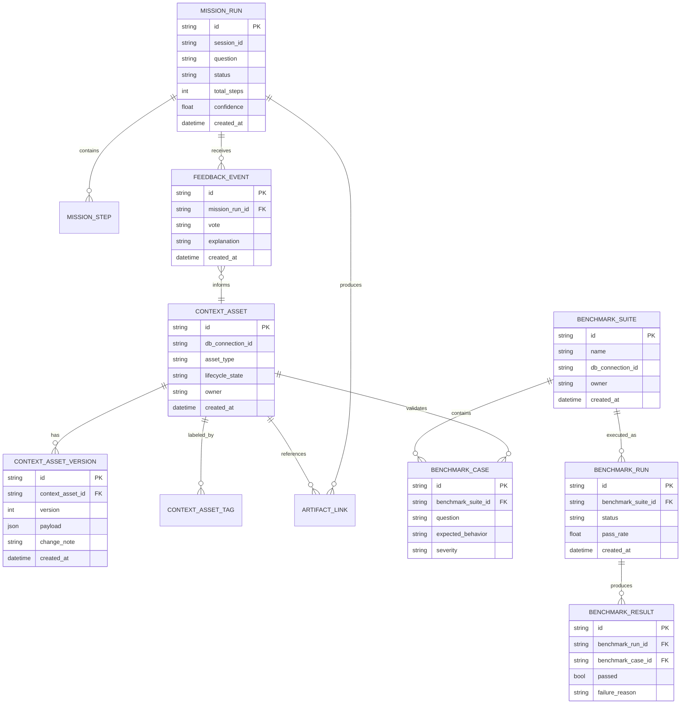

# Plan: Build Agentic Context Platform for Reliable Autonomous Analytics

## Task Description

Build KAI v1 as a context-first analytics agent platform for analyst teams, with full CLI and UI parity and full-autopilot missions by default. The platform will treat context assets (rules, verified SQL, semantic metadata, mission playbooks, eval cases) as first-class product artifacts.

This plan is based on the approved brainstorm:
- `docs/brainstorms/2026-02-13-kai-agentic-context-platform-brainstorm.md`

## Objective

Deliver a unified Agentic Context Platform composed of:
1. **Context Asset Layer** - First-class storage and lifecycle for rules, verified SQL, mission templates, benchmark cases, feedback corrections
2. **Mission Orchestration Layer** - Proactive full-autopilot mission loop with reusable artifact outputs
3. **Reliability and Governance Layer** - Benchmark execution, scoring, promotion workflows, drift visibility
4. **Cross-Surface Contract Layer** - One mission/event contract for CLI and UI

### KPI Targets
- `>=90%` pass rate on curated reliability suite
- `>=70%` output reuse across analyst tasks
- Measurable reduction in repeated failure classes via feedback-linked corrections

## Problem Statement

KAI already has strong autonomous pieces, but they operate as separate capabilities instead of one cohesive analyst operating model. This creates three problems:

1. **Reliability drift**: no unified, first-class benchmark loop for analyst workflows.
2. **Reuse friction**: verified SQL, memory, and notebooks exist but are not managed as one lifecycle.
3. **Autonomy trust gap**: proactive automation lacks clear quality gates and governance semantics.

## Overview

### Enhancement Summary

**Deepened on:** 2026-02-13
**Sections enhanced:** 10
**Research lenses used:** agent-native architecture, system architecture, security, performance, SpecFlow flow analysis, official framework docs (LangGraph, FastAPI, pytest)

### Key Improvements
1. Added concrete autopilot guardrails (runtime/tool/retry/cost bounds) and interruption policy.
2. Added explicit context asset lifecycle defaults and publish governance model.
3. Added deterministic benchmark contract (case schema, scoring, CI/reporting).
4. Added cross-surface event contract hardening and parity matrix guidance.
5. Added rollout strategy with feature flags, migration path, and go/no-go quality gates.

### Locked Decisions from Brainstorm
- Primary user: analyst team
- KPI targets: `>=90%` pass rate on curated reliability suite, `>=70%` output reuse
- Product shape: full context platform (not feature patch)
- Delivery scope: CLI + UI parity in v1
- Autonomy default: full autopilot

### Research Insights

**Architecture guidance (agent-native lens):**
- Preserve action parity: every analyst outcome available in UI must be achievable via CLI/tools and vice versa.
- Keep tool primitives composable; avoid embedding too much policy in single tools to preserve emergent capability.

**Security guidance:**
- Treat asset promotion and autopilot high-impact actions as authorization boundaries.
- Ensure feedback/correction ingestion has validation to prevent policy-poisoning and low-quality memory pollution.

**Performance guidance:**
- Assume workload growth by 10-100x analyst sessions; require bounded mission loops and measurable SLOs.
- Prefer append-only run artifacts with indexed summaries over expensive full-log scans at request time.

## Relevant Files

### Existing Files to Extend/Modify

**Backend - Autonomous Agent Core:**
- `app/modules/autonomous_agent/service.py` - Tool orchestration (lines 340, 388)
- `app/modules/autonomous_agent/models.py` - Mission state models
- `app/modules/autonomous_agent/api/endpoints.py` - Streaming endpoints (lines 45, 274)
- `app/modules/autonomous_agent/audit_logger.py` - Audit tracing (lines 22, 121)
- `app/modules/autonomous_agent/main.py` - CLI entrypoint
- `app/modules/autonomous_agent/tools/context_store_tools.py` - Verified SQL tools (lines 15, 116)
- `app/modules/autonomous_agent/tools/memory_tools.py` - Memory lifecycle (lines 129, 205)
- `app/modules/autonomous_agent/tools/notebook_tools.py` - Notebook artifacts

**Frontend - Chat/Mission UI:**
- `ui/src/app/chat/page.tsx` - Chat page
- `ui/src/components/chat/agent-message.tsx` - Message handling (line 44)
- `ui/src/lib/api/types.ts` - Event typing contract (line 167)

**Infrastructure:**
- `CLAUDE.md` - Architecture conventions (lines 143, 147, 162)
- `app/data/db/storage.py` - Typesense wrapper

### New Files to Create

**Context Platform Module:**
- `app/modules/context_platform/__init__.py`
- `app/modules/context_platform/models/__init__.py` - Context asset entities
- `app/modules/context_platform/models/asset.py`
- `app/modules/context_platform/models/benchmark.py`
- `app/modules/context_platform/repositories/__init__.py`
- `app/modules/context_platform/repositories/asset_repository.py`
- `app/modules/context_platform/repositories/benchmark_repository.py`
- `app/modules/context_platform/services/__init__.py`
- `app/modules/context_platform/services/asset_service.py`
- `app/modules/context_platform/services/benchmark_service.py`
- `app/modules/context_platform/api/__init__.py`
- `app/modules/context_platform/api/endpoints.py`

**CLI Extensions:**
- `app/modules/autonomous_agent/cli/context.py` - Context CLI commands
- `app/modules/autonomous_agent/cli/benchmark.py` - Benchmark CLI commands

**Test Files:**
- `tests/modules/context_platform/test_models.py`
- `tests/modules/context_platform/test_repository.py`
- `tests/modules/context_platform/test_service.py`
- `tests/modules/autonomous_agent/test_mission_stream_contract.py`
- `tests/modules/autonomous_agent/test_mission_guardrails.py`
- `tests/modules/autonomous_agent/test_benchmark_cli.py`
- `ui/tests/e2e/mission-parity.spec.ts`
- `ui/tests/e2e/asset-promotion.spec.ts`
- `ui/tests/e2e/feedback-linkage.spec.ts`

## Proposed Solution

### Architecture

- Extend existing module pattern (`models/`, `repositories/`, `services/`) per `CLAUDE.md:143`.
- Reuse current autonomous agent toolchain as baseline (`app/modules/autonomous_agent/service.py:340`).
- Add dedicated context-platform modules (no monolithic rewrite).
- Keep API registration and service composition consistent with current app conventions (`CLAUDE.md:162`).

### LangGraph Durability Patterns
- Use persistent checkpointers for mission continuity and deterministic resume behavior.
- Use explicit `thread_id` scoping for mission/session separation to avoid context bleed.
- Use interrupt/resume semantics for high-risk actions (publish/deprecate/destructive writes).
- Use strict durability for critical transitions (promotion, benchmark writes, feedback linkage).

### FastAPI Streaming Patterns
- Standardize SSE responses via `StreamingResponse(..., media_type="text/event-stream")`.
- Normalize event envelope and versioning to preserve UI compatibility.
- Add explicit stream heartbeats and disconnect-aware cleanup behavior.

### Data Model (ERD)



### Mission Event Envelope (CLI/UI Contract)

```json
{
  "version": "v1",
  "type": "mission_stage",
  "stage": "plan|explore|execute|synthesize|finalize",
  "mission_id": "mission_xxx",
  "session_id": "sess_xxx",
  "timestamp": "2026-02-13T00:00:00Z",
  "payload": {}
}
```

### Benchmark Case Schema

```yaml
id: case_revenue_trend_qoq
question: "Show quarter-over-quarter revenue trend for the last 8 quarters"
expected:
  sql_behavior: "uses time grain quarter and grouped aggregation"
  minimum_fields: ["quarter", "revenue"]
  acceptance_rules:
    - "no empty dataset explanation if data exists"
    - "includes at least one follow-up suggestion"
severity: critical
tags: [trend, revenue, executive]
```

## Team Orchestration

As the team lead, you have access to powerful tools for coordinating work across multiple agents. You NEVER write code directly - you orchestrate team members using these tools.

### Task Management Tools

**TaskCreate** - Create tasks in the shared task list:

```typescript
TaskCreate({
  subject: "Implement context asset models",
  description: "Create models for context asset lifecycle...",
  activeForm: "Implementing context asset models"
})
```

**TaskUpdate** - Update task status, assignment, or dependencies:

```typescript
TaskUpdate({
  taskId: "1",
  status: "in_progress",
  owner: "builder-backend"
})
```

**TaskList** - View all tasks and their status:

```typescript
TaskList({})
```

### Task Dependencies

Use `addBlockedBy` to create sequential dependencies:

```typescript
// Task 2 depends on Task 1
TaskUpdate({
  taskId: "2",
  addBlockedBy: ["1"]
})
```

### Agent Deployment with Task Tool

**Task** - Deploy an agent to do work:

```typescript
Task({
  description: "Implement context asset service",
  prompt: "Implement the context asset service as specified in Task 2...",
  subagent_type: "general-purpose",
  model: "sonnet",
  run_in_background: true
})
```

### Team Members

Based on the tech stack (Python/FastAPI backend, TypeScript/React UI, LangGraph):

#### Backend Builder
- **Name:** `builder-backend`
- **Role:** Python/FastAPI backend development
- **Agent Type:** `general-purpose`
- **Responsibilities:**
  - Context platform module (models, repositories, services)
  - Mission orchestration enhancements
  - Benchmark service and scoring
  - API endpoints
- **Resume:** true

#### Frontend Builder
- **Name:** `builder-frontend`
- **Role:** TypeScript/React UI development
- **Agent Type:** `general-purpose`
- **Responsibilities:**
  - Mission controls and asset promotion UX
  - Chat component enhancements
  - Event contract compliance
- **Resume:** true

#### QA Builder
- **Name:** `builder-qa`
- **Role:** Test development and validation
- **Agent Type:** `general-purpose`
- **Responsibilities:**
  - Unit tests for context platform
  - Integration tests for mission flows
  - E2E tests for UI parity
- **Resume:** true

## Step by Step Tasks

### Phase 1: Context Asset Substrate 🟡

Goal: Establish context-as-assets and lifecycle governance.

#### Task 1.1: Create Context Asset Models
- **Task ID:** `phase1-models`
- **Depends On:** none
- **Assigned To:** `builder-backend`
- **Agent Type:** `general-purpose`
- **Parallel:** false
- **Files:**
  - `app/modules/context_platform/models/__init__.py`
  - `app/modules/context_platform/models/asset.py`
- **Requirements:**
  - Define `ContextAsset`, `ContextAssetVersion`, `ContextAssetTag` models
  - Lifecycle states: `draft`, `verified`, `published`, `deprecated`
  - Uniqueness constraints for `(db_connection_id, asset_type, canonical_key, version)`
- **Success Criteria:**
  - [ ] Models pass Pydantic validation
  - [ ] Unit tests in `tests/modules/context_platform/test_models.py`

#### Task 1.2: Create Context Asset Repository
- **Task ID:** `phase1-repository`
- **Depends On:** `phase1-models`
- **Assigned To:** `builder-backend`
- **Agent Type:** `general-purpose`
- **Parallel:** false
- **Files:**
  - `app/modules/context_platform/repositories/__init__.py`
  - `app/modules/context_platform/repositories/asset_repository.py`
- **Requirements:**
  - CRUD operations for context assets
  - Versioning support with immutable versions
  - Indexed queries on `db_connection_id`, `asset_type`, `lifecycle_state`
- **Success Criteria:**
  - [ ] Repository integrates with Typesense storage
  - [ ] Unit tests in `tests/modules/context_platform/test_repository.py`

#### Task 1.3: Create Context Asset Service
- **Task ID:** `phase1-service`
- **Depends On:** `phase1-repository`
- **Assigned To:** `builder-backend`
- **Agent Type:** `general-purpose`
- **Parallel:** false
- **Files:**
  - `app/modules/context_platform/services/__init__.py`
  - `app/modules/context_platform/services/asset_service.py`
- **Requirements:**
  - Lifecycle transition logic with policy checks
  - Promotion metadata (`promoted_by`, `promoted_at`, `change_note`)
  - Integration with existing verified SQL and memory tools
- **Success Criteria:**
  - [ ] Service enforces lifecycle policies
  - [ ] Unit tests in `tests/modules/context_platform/test_service.py`

#### Task 1.4: Add Context Asset API Endpoints
- **Task ID:** `phase1-api`
- **Depends On:** `phase1-service`
- **Assigned To:** `builder-backend`
- **Agent Type:** `general-purpose`
- **Parallel:** false
- **Files:**
  - `app/modules/context_platform/api/__init__.py`
  - `app/modules/context_platform/api/endpoints.py`
- **Requirements:**
  - CRUD endpoints for context assets
  - Lifecycle transition endpoints
  - Role-based authorization for publish/deprecate
- **Success Criteria:**
  - [ ] Endpoints registered in `app/api/__init__.py`
  - [ ] Integration tests passing

---

### Phase 2: Proactive Mission Orchestration ⬜

Goal: Full-autopilot mission execution with reusable artifact outputs.

#### Task 2.1: Add Mission Contracts
- **Task ID:** `phase2-mission-models`
- **Depends On:** `phase1-api`
- **Assigned To:** `builder-backend`
- **Agent Type:** `general-purpose`
- **Parallel:** false
- **Files:**
  - `app/modules/autonomous_agent/models.py` (extend)
- **Requirements:**
  - Mission-level state and confidence metadata
  - Mission plan persistence for inspection
  - Stage-level confidence scoring
- **Success Criteria:**
  - [ ] Mission state model supports proactive flow
  - [ ] Backward compatible with existing sessions

#### Task 2.2: Extend Mission Stream Events
- **Task ID:** `phase2-stream-events`
- **Depends On:** `phase2-mission-models`
- **Assigned To:** `builder-backend`
- **Agent Type:** `general-purpose`
- **Parallel:** false
- **Files:**
  - `app/modules/autonomous_agent/service.py` (extend)
- **Requirements:**
  - Proactive stages: plan, explore, execute, synthesize, finalize
  - Mission budget enforcement (runtime, tool calls, retries)
  - Cross-surface event compatibility
- **Success Criteria:**
  - [ ] Events emit with stable schemas
  - [ ] Budget enforcement prevents runaway execution

#### Task 2.3: Add Mission Artifacts
- **Task ID:** `phase2-artifacts`
- **Depends On:** `phase2-stream-events`
- **Assigned To:** `builder-backend`
- **Agent Type:** `general-purpose`
- **Parallel:** false
- **Files:**
  - `app/modules/autonomous_agent/tools/notebook_tools.py` (extend)
- **Requirements:**
  - Verified SQL candidate artifacts
  - Notebook artifact generation
  - Summary artifact with provenance
- **Success Criteria:**
  - [ ] Artifacts linked to mission runs
  - [ ] Provenance traceable to source assets

#### Task 2.4: UI Event Contract Compliance
- **Task ID:** `phase2-ui-contract`
- **Depends On:** `phase2-stream-events`
- **Assigned To:** `builder-frontend`
- **Agent Type:** `general-purpose`
- **Parallel:** true (parallel with Task 2.3)
- **Files:**
  - `ui/src/lib/api/types.ts` (extend)
  - `ui/src/components/chat/agent-message.tsx` (extend)
- **Requirements:**
  - Update event types for new mission stages
  - Handle confidence and budget metadata in UI
  - Backward compatibility with existing events
- **Success Criteria:**
  - [ ] UI renders new event types correctly
  - [ ] No breaking changes to existing flows

---

### Phase 3: Reliability Harness and Quality Gates ⬜

Goal: Implement benchmark loop and enforce reliability KPI.

#### Task 3.1: Create Benchmark Models
- **Task ID:** `phase3-benchmark-models`
- **Depends On:** `phase2-artifacts`
- **Assigned To:** `builder-backend`
- **Agent Type:** `general-purpose`
- **Parallel:** false
- **Files:**
  - `app/modules/context_platform/models/benchmark.py`
- **Requirements:**
  - `BenchmarkSuite`, `BenchmarkCase`, `BenchmarkRun`, `BenchmarkResult` models
  - Case tagging support (smoke, critical, domain)
  - Severity-weighted scoring
- **Success Criteria:**
  - [ ] Models pass validation
  - [ ] Unit tests passing

#### Task 3.2: Create Benchmark Repository and Service
- **Task ID:** `phase3-benchmark-service`
- **Depends On:** `phase3-benchmark-models`
- **Assigned To:** `builder-backend`
- **Agent Type:** `general-purpose`
- **Parallel:** false
- **Files:**
  - `app/modules/context_platform/repositories/benchmark_repository.py`
  - `app/modules/context_platform/services/benchmark_service.py`
- **Requirements:**
  - Benchmark execution and scoring logic
  - Deterministic pass/fail evaluation
  - Failure fingerprint persistence
  - CI artifact export (JSON + JUnit XML)
- **Success Criteria:**
  - [ ] Scoring is deterministic and reproducible
  - [ ] Reports export correctly

#### Task 3.3: Add Benchmark CLI Commands
- **Task ID:** `phase3-benchmark-cli`
- **Depends On:** `phase3-benchmark-service`
- **Assigned To:** `builder-backend`
- **Agent Type:** `general-purpose`
- **Parallel:** false
- **Files:**
  - `app/modules/autonomous_agent/cli/benchmark.py`
  - `app/modules/autonomous_agent/main.py` (extend)
- **Requirements:**
  - `kai benchmark run` command
  - `kai benchmark list` command
  - Selective suite execution by tags
- **Success Criteria:**
  - [ ] CLI commands functional
  - [ ] Tests in `tests/modules/autonomous_agent/test_benchmark_cli.py`

#### Task 3.4: Add Benchmark API Endpoints
- **Task ID:** `phase3-benchmark-api`
- **Depends On:** `phase3-benchmark-service`
- **Assigned To:** `builder-backend`
- **Agent Type:** `general-purpose`
- **Parallel:** true (parallel with Task 3.3)
- **Files:**
  - `app/modules/context_platform/api/endpoints.py` (extend)
- **Requirements:**
  - Benchmark execution endpoints
  - Report retrieval endpoints
  - Run history visibility
- **Success Criteria:**
  - [ ] Endpoints functional
  - [ ] Integration tests passing

---

### Phase 4: CLI/UI Parity and Feedback Learning Loop ⬜

Goal: Full parity and closed-loop learning for reuse KPI.

#### Task 4.1: Add Context CLI Commands
- **Task ID:** `phase4-context-cli`
- **Depends On:** `phase3-benchmark-cli`
- **Assigned To:** `builder-backend`
- **Agent Type:** `general-purpose`
- **Parallel:** false
- **Files:**
  - `app/modules/autonomous_agent/cli/context.py`
  - `app/modules/autonomous_agent/main.py` (extend)
- **Requirements:**
  - `kai context list/show/promote/deprecate` commands
  - Parity with UI context management
- **Success Criteria:**
  - [ ] All context operations available via CLI
  - [ ] Command tests passing

#### Task 4.2: Add Feedback Endpoint
- **Task ID:** `phase4-feedback-api`
- **Depends On:** `phase4-context-cli`
- **Assigned To:** `builder-backend`
- **Agent Type:** `general-purpose`
- **Parallel:** false
- **Files:**
  - `app/modules/context_platform/api/endpoints.py` (extend)
- **Requirements:**
  - Feedback submission endpoint
  - Linkage to mission run, context asset, benchmark case
  - Validation and size limits
- **Success Criteria:**
  - [ ] Feedback linked to assets and runs
  - [ ] Quality gates for negative feedback on published assets

#### Task 4.3: Add UI Mission Controls
- **Task ID:** `phase4-ui-controls`
- **Depends On:** `phase2-ui-contract`
- **Assigned To:** `builder-frontend`
- **Agent Type:** `general-purpose`
- **Parallel:** true (parallel with backend tasks)
- **Files:**
  - `ui/src/app/chat/page.tsx` (extend)
  - `ui/src/components/chat/` (extend)
- **Requirements:**
  - Mission plan inspection
  - Asset promotion UX
  - Feedback submission UI
- **Success Criteria:**
  - [ ] All critical analyst flows executable from UI
  - [ ] E2E tests in `ui/tests/e2e/mission-parity.spec.ts`

#### Task 4.4: Add Reuse Telemetry
- **Task ID:** `phase4-telemetry`
- **Depends On:** `phase4-feedback-api`
- **Assigned To:** `builder-backend`
- **Agent Type:** `general-purpose`
- **Parallel:** false
- **Files:**
  - `app/modules/context_platform/services/telemetry_service.py` (new)
- **Requirements:**
  - Track artifact reuse events
  - Compute reuse metric for KPI
  - Dashboard-ready aggregates
- **Success Criteria:**
  - [ ] Reuse events measurable
  - [ ] Metric attributable to specific assets

#### Task 4.5: QA and E2E Tests
- **Task ID:** `phase4-qa`
- **Depends On:** `phase4-ui-controls`, `phase4-telemetry`
- **Assigned To:** `builder-qa`
- **Agent Type:** `general-purpose`
- **Parallel:** false
- **Files:**
  - `ui/tests/e2e/asset-promotion.spec.ts`
  - `ui/tests/e2e/feedback-linkage.spec.ts`
  - All test files validation
- **Requirements:**
  - Complete E2E test coverage
  - Parity matrix verification
  - Regression suite run
- **Success Criteria:**
  - [ ] All E2E tests passing
  - [ ] Parity matrix complete

---

## Acceptance Criteria

### Functional Requirements
- [ ] Analysts can define and manage context assets with lifecycle states.
- [ ] Full-autopilot missions produce reusable artifacts and mission traces.
- [ ] Verified SQL, notebooks, and corrections are linkable to context assets.
- [ ] Analysts can run benchmark suites and inspect run-level failures.
- [ ] CLI and UI provide equivalent core mission + context workflows.

### Non-Functional Requirements
- [ ] Mission runs are bounded by explicit safety limits (time/steps/retries).
- [ ] Benchmark scoring is deterministic and reproducible.
- [ ] Auditability exists for asset changes, mission steps, and feedback linkage.
- [ ] Event contract supports backward-compatible UI streaming.

### Security and Safety Requirements
- [ ] Asset promotion endpoints enforce role-based authorization and audit fields.
- [ ] All feedback/correction inputs are validated and size-limited before persistence.
- [ ] SQL execution paths remain read-only by default unless explicitly authorized.
- [ ] Prompt/context injection paths sanitize untrusted user-provided metadata.
- [ ] Sensitive identifiers and connection details are excluded from end-user stream payloads.

### Performance Requirements
- [ ] P50 mission startup latency under 2s for warm sessions.
- [ ] P95 mission stream event delivery gap under 1s for active runs.
- [ ] Benchmark run summary generation under 5s for suites up to 100 cases.
- [ ] No unbounded in-memory buffers for long-running mission streams.

### Quality Gates
- [ ] Unit tests added for new context-platform services and repositories.
- [ ] Integration tests added for mission-to-artifact and benchmark flows.
- [ ] CLI command tests added for new context/benchmark commands.
- [ ] UI E2E tests added for mission parity and feedback-link behavior.
- [ ] Documentation updated for analyst operational workflows.

## Success Metrics

| Metric | Target | Measurement |
|--------|--------|-------------|
| Reliability KPI | `>=90%` | Curated benchmark suite pass rate |
| Reuse KPI | `>=70%` | Verified artifact reuse across analyst tasks |
| Operational KPI | Reduction | Repeated failure classes via feedback-linked corrections |

## Dependencies and Prerequisites

### External Dependencies
| Dependency | Version | Purpose | Risk |
|------------|---------|---------|------|
| FastAPI | current | REST API framework | Low |
| LangGraph | current | Agent orchestration | Medium |
| Typesense | current | Vector storage | Low |
| pytest | current | Testing framework | Low |

### Internal Dependencies
| Dependency | Status | Notes |
|------------|--------|-------|
| Autonomous agent infrastructure | Available | Baseline for execution |
| Typesense storage backend | Available | Persistence layer |
| Memory tools | Available | Extend for context assets |

## Risk Analysis and Mitigation

| Risk | Probability | Impact | Mitigation |
|------|-------------|--------|------------|
| Scope inflation from "platform" framing | Medium | High | Phase gates with explicit exit criteria |
| Full-autopilot low-confidence polished output | Medium | High | Confidence scoring and benchmark-linked checks |
| KPI ambiguity (`reuse`) | Medium | Medium | Lock metric definition in phase 1 |
| CLI/UI contract drift | Low | High | Shared event schema and parity tests |

## Rollout and Migration Strategy

### Rollout Stages

1. **Stage A (internal alpha)**
   Enable context-platform features behind feature flags for analyst power users only.

2. **Stage B (analyst beta)**
   Enable benchmark loop and artifact promotion for selected production-like datasets.

3. **Stage C (general availability)**
   Turn on full parity behavior and hard quality gates for reliability threshold.

### Feature Flags (initial)

- `FEATURE_CONTEXT_PLATFORM_ENABLED`
- `FEATURE_AUTOPILOT_MISSIONS_ENABLED`
- `FEATURE_BENCHMARK_GATES_ENABLED`
- `FEATURE_PARITY_ENFORCEMENT_ENABLED`

### Migration

- Backfill existing verified SQL records into `context_asset` + `context_asset_version`.
- Backfill recent session artifacts with minimal provenance linkage.
- Keep legacy read paths active during migration window; switch writes to new model first.

### Planning Defaults

- Context lifecycle: `draft -> verified -> published -> deprecated`
- Reuse event: artifact is counted as reused when selected or auto-included in a later successful mission and not overridden
- Full-autopilot limits:
  - max mission runtime: 180 seconds
  - max tool calls: 40
  - max consecutive empty SQL attempts: 3
  - max identical failure retries: 2
- Publish policy: analyst can `draft/verify`; maintainer role can `publish/deprecate`
- Quality gate policy:
  - pre-phase-3: advisory warning on reliability regressions
  - phase-3 and later: block release when suite pass rate falls below threshold

## Validation Commands

```bash
# Run all context platform tests
uv run pytest tests/modules/context_platform/

# Run mission contract tests
uv run pytest tests/modules/autonomous_agent/test_mission_stream_contract.py

# Run benchmark CLI tests
uv run pytest tests/modules/autonomous_agent/test_benchmark_cli.py

# Run full test suite
uv run pytest

# Start dev server for manual testing
uv run python -m app.main
```

## Documentation Plan

| Document | Location | When |
|----------|----------|------|
| Context asset guide | `docs/context-assets.md` | Phase 1 |
| Benchmark guide | `docs/benchmark-guide.md` | Phase 3 |
| CLI reference update | `README.md` | Phase 4 |
| API reference | `docs/apis/` | Phase 4 |

## References

### Internal References
- Brainstorm source: `docs/brainstorms/2026-02-13-kai-agentic-context-platform-brainstorm.md`
- Original plan: `docs/plans/2026-02-13-feat-agentic-context-platform-autonomous-analytics-plan.md`
- Architecture conventions: `CLAUDE.md`

### External Framework References
- LangGraph memory: https://docs.langchain.com/oss/python/langgraph/add-memory
- LangGraph interrupts: https://docs.langchain.com/oss/python/langgraph/interrupts
- FastAPI streaming: https://fastapi.tiangolo.com/advanced/custom-response/
- pytest parametrization: https://docs.pytest.org/en/stable/how-to/parametrize.html

---

## Checklist Summary

### Phase 1: Context Asset Substrate 🟡
- [ ] Task 1.1: Create Context Asset Models (`builder-backend`)
- [ ] Task 1.2: Create Context Asset Repository (`builder-backend`)
- [ ] Task 1.3: Create Context Asset Service (`builder-backend`)
- [ ] Task 1.4: Add Context Asset API Endpoints (`builder-backend`)

### Phase 2: Proactive Mission Orchestration ⬜
- [ ] Task 2.1: Add Mission Contracts (`builder-backend`)
- [ ] Task 2.2: Extend Mission Stream Events (`builder-backend`)
- [ ] Task 2.3: Add Mission Artifacts (`builder-backend`)
- [ ] Task 2.4: UI Event Contract Compliance (`builder-frontend`)

### Phase 3: Reliability Harness and Quality Gates ⬜
- [ ] Task 3.1: Create Benchmark Models (`builder-backend`)
- [ ] Task 3.2: Create Benchmark Repository and Service (`builder-backend`)
- [ ] Task 3.3: Add Benchmark CLI Commands (`builder-backend`)
- [ ] Task 3.4: Add Benchmark API Endpoints (`builder-backend`)

### Phase 4: CLI/UI Parity and Feedback Learning Loop ⬜
- [ ] Task 4.1: Add Context CLI Commands (`builder-backend`)
- [ ] Task 4.2: Add Feedback Endpoint (`builder-backend`)
- [ ] Task 4.3: Add UI Mission Controls (`builder-frontend`)
- [ ] Task 4.4: Add Reuse Telemetry (`builder-backend`)
- [ ] Task 4.5: QA and E2E Tests (`builder-qa`)
